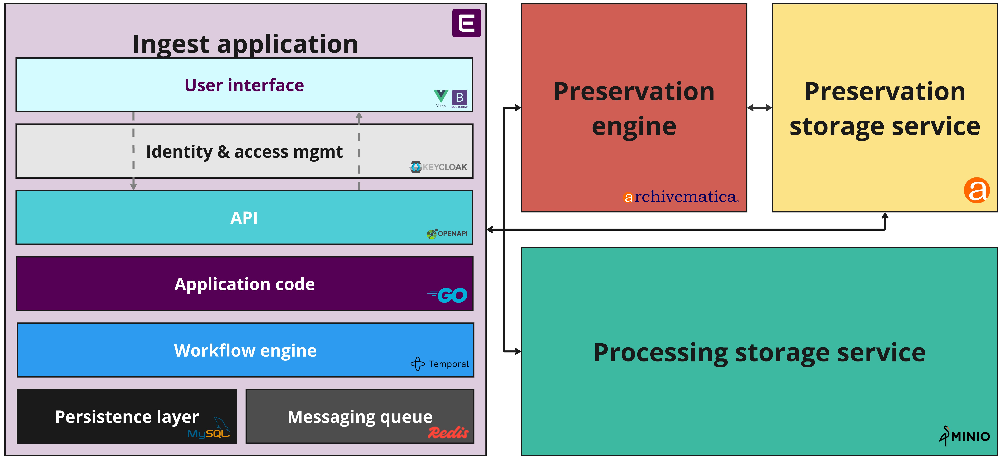

# Components

Enduro Ingest is composed of a number of different components used to provide
ingest and preservation functionality.

## Processing storage service

The processing storage service acts as Enduro's storage back-end for any local
package interactions that are needed as part of ingest and preservation
workflows. Examples include:

* Uploading Submission Information Packages (SIPs) for ingest
* Depositing failed ingest packages after a workflow error
* Passing other package types (such as a search metadata bundle) to external
  systems

If desired, it can also be configured for the long-term storage of Archival
Information Packages (AIPs) after preservation has completed succesfully.

Currently, Enduro uses [MinIO](https://min.io/) as its processing storage
service. MinIO is a flexible, high performance object storage platform. Material
intended for preservation can be uploaded to MinIO either through its user
interface or via command line using the [MinIO
client](https://min.io/docs/minio/linux/reference/minio-mc.html).

## Messaging queue

The messaging queue acts as a watcher for SIPs deposited for ingest into the
[processing storage service](#processing-storage-service). Thanks to this
watcher, any time new content is uploaded to a designated bucket in MinIO, an
ingest workflow is started in Enduro.

Enduro Ingest uses [Redis](https://redis.io/) as a messaging queue, to ensure
reliable communication between the ingest application and the processing storage
service.

## Workflow engine

The workflow engine is responsible for orchestrating Enduro's workflows - for
kicking off preservation actions and other tasks, managing them, and recording
them as auditable events. It also manages retries and timeouts, resulting in a
reliable platform that can process digital objects for preservation in a highly
automated environment.

Currently, Enduro Ingest uses [Temporal](https://temporal.io/) as its workflow
engine.

## Application code

The application code is where the business logic guiding Enduro's workflows is
written. It is the glue that helps each component in the Enduro Ingest stack act
in concert, to assist operators achieve their preservation goals.

Enduro  uses the Go programming language ([GoLang](https://go.dev/)) for its
application code.

## Application Programming Interface (API)

The [API](https://en.wikipedia.org/wiki/API) is how Enduro Ingest communicates
with its [user interface](#user-interface), and how external users and
applications can interact with Enduro. The Enduro Ingest API defines multiple
services which map to resources in [REST](https://en.wikipedia.org/wiki/REST).
Services define their own methods, errors, and so on.

Enduro's application code uses the [Goa design language](https://goa.design/) to
structure its API design. The API itself uses [Swagger](https://swagger.io/) to
generate its documentation and ensure it conforms to
[OpenAPI](https://www.openapis.org/) design specifications.

## Identity & access management (IAM)

The Identity & access management (IAM) component provides authentication as well
as role-based access control
([RBAC](https://en.wikipedia.org/wiki/Role-based_access_control)) to manage user
permissions and roles in Enduro Ingest.
[API](#application-programming-interface-api) requests must be authorized by the
IAM component before their contents are delivered or displayed in the [user
interface](#user-interface), ensuring that sensitive information is only shared
with authorized users and/or applications.

[Keycloak](https://www.keycloak.org/) is currently used for Enduro Ingest's IAM
component. Keycloak is based on standard protocols and provides support for
OpenID Connect, OAuth 2.0, and SAML.

## User interface

Enduro Ingest's web-based user interface is the graphical method by which
operators can interact with Enduro to see and manage ingest and preservation
workflows, view information about packages, and more. Key information from other
components and applications (such as tasks executed by the [preservation
engine](#preservation-engine) in a workflow) is also collected via API and shown
in the Enduro Ingest user interface when relevant.

Enduro's user interface is built using [Vue.js](https://vuejs.org/) and
[Bootstrap](https://getbootstrap.com/).

## Preservation engine

The preservation engine manages the transformation of Processing Information
Packages (PIPs) into Archival Information Packages (AIPs). The preservation
engine is equipped with a number of tools and microservices to perform
preservation tasks (such as characterization, metadata capture, and
normalization, etc.), and communicates the outcome of these actions back to
Enduro for display in the [user interface](#user-interface).

Enduro Ingest currently supports two different preservation engines:

* [Archivematica](https://archivematica.org) is an open-source digital
  preservation system that is designed to maintain standards-based, long-term
  access to collections of digital objects. It provides an integrated suite of
  free and open-source tools that allows users to process digital objects and
  generate Archival Information Packages (AIPs) in compliance with the Open
  Archival Information System
  ([OAIS](https://en.wikipedia.org/wiki/Open_Archival_Information_System))
  functional model and other digital preservation standards and best practices,
  define preservation policies, manage processing configurations, and more.
  Archivematica includes a web-based dashboard for user interaction, as well as
  a set of [API](https://en.wikipedia.org/wiki/API) endpoints that Enduro uses
  to integrate with Archivematica and display preservation task outcomes in the
  Enduro user interface.
* [a3m](https://github.com/artefactual-labs/a3m) is a streamlined version of
  Archivematica that is wholly focused on AIP creation. It does not have
  external dependencies, integration with access systems, search capabilities,
  or a graphical user interface. a3m was designed  to remove many Archivematica
  features that are not required for operating at a large scale to improve AIP
  creation throughput.

## Preservation storage service

The preservation storage service acts as an interface between the [preservation
engine](#preservation-engine) and whatever storage devices have been configured
for the long-term preservation of AIPs produced by Enduro workflows. The storage
service manages the storage, movement, replication, and deletion of packages,
and other related functions such as location management, encryption, fixity
checking, and more.

Currently Enduro uses the [Archivematica](https://archivematica.org) Storage
Service ([AMSS](https://github.com/artefactual/archivematica-storage-service))
when using Archivematica as the system's preservation engine. When using a3m,
Enduro uses its own lightweight storage functionality to cover basic storage
service requirements.
