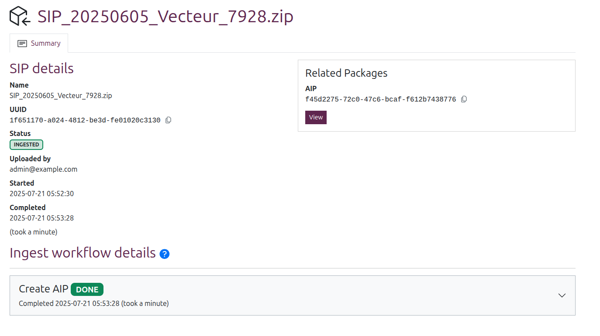
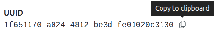
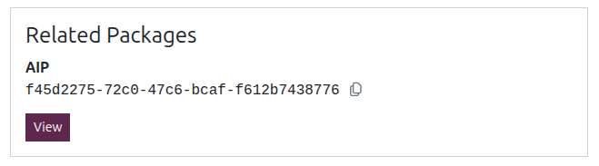
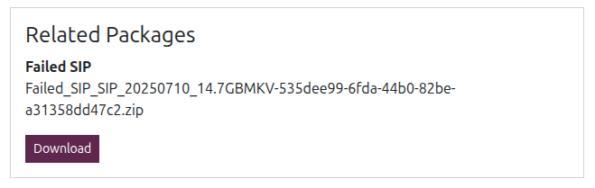
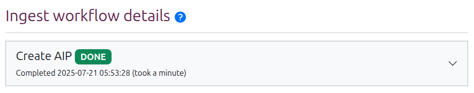
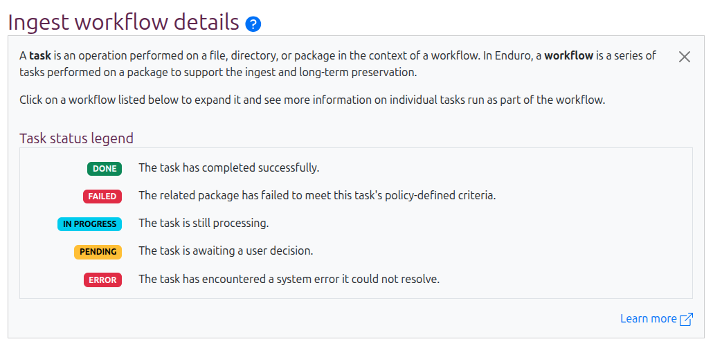
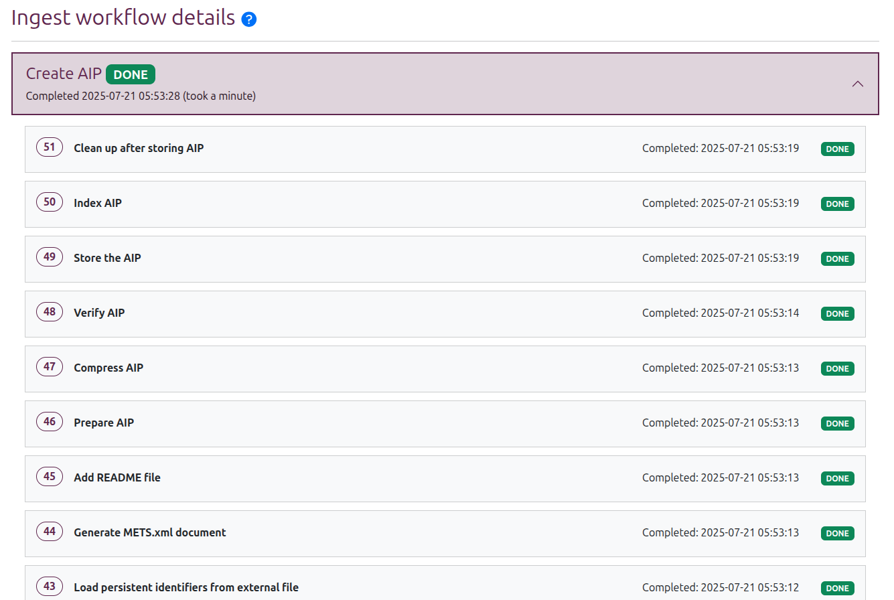
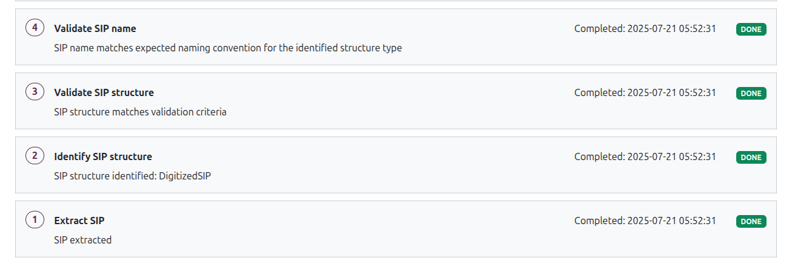
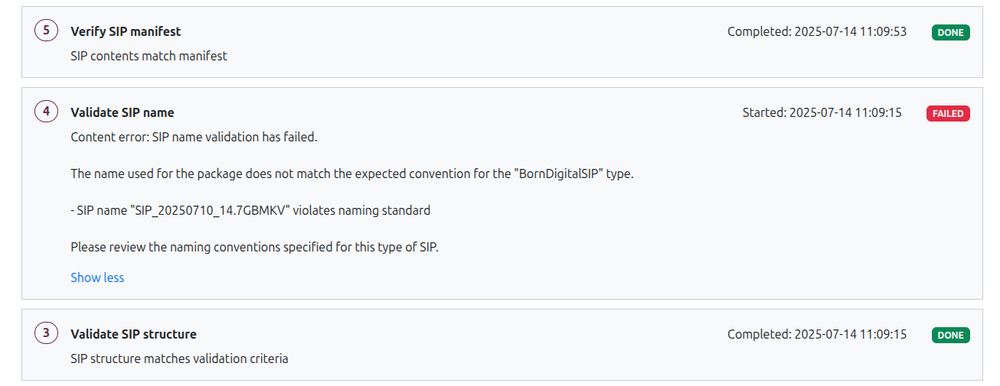

# Managing ingest workflows

Everything you need to know to manage SIP ingests after they are uploaded

-----

## SIP view pages

The SIP view page provides a high-level overview of a given SIP and any ingest
workflows that have been and their outcome. Additionally, any
[related packages](#related-packages) derived from the SIP during processing are
linked as well.

The page title will be the SIP name. The SIP UUID is used to construct the page
URL. The page is then organized into 3 main sections:

* [SIP details](#sip-details)
* [Related packages](#related-packages)
* [Ingest workflow details](#workflows-and-activities)

### SIP details

SIP details are found in the body of the SIP view page. This section provides a
few high-level metadata elements about the SIP and its ingest, including:

* **Name**: Name of the SIP at ingest time. Should match the page title.
* **UUID**: The unique identifier associated with the SIP. Either extracted from
  the SIP metadata, or assigned by Enduro if no existing UUID is found.

!!! tip

    You can quickly copy the UUID by clicking the icon to the right of it

     

* **Status**: The status of the SIP. Uses the [same statuses as those shown on
  the SIP browse page.](search-browse.md#sip-statuses).
* **Uploaded by**: The user associated with initiating the SIP ingest by
  uploading the package. How user information displays in this field depends on
  whether authentication is enabled and what information is available from the
  provider - for more information, see:
  [User filters and authentication configuration](../overview.md#user-filters-and-authentication-configuration).
* **Started**: Timestamp of when the ingest workflow started.
* **Completed**: Timestamp of when the ingest workflow ended. An estimate of the
  total time of the ingest will also be shown below in parentheses.

!!! tip

    Internally, Enduro will store timestamps in Coordinated Universal Time, i.e.
    [UTC](https://en.wikipedia.org/wiki/Coordinated_Universal_Time). However,
    the user interface will then render those timestamps based on your browser's
    or operating system's configured timezone settings.

### Related packages

The related packages widget, on the right side of the SIP view page, shows any
packages derived from the original upload during the ingest. This can include:

**Related AIPs**: If the ingest is successful, one or more AIPs will be created
following ingest, depending on the ingest workflow activities.

You can click the "View" button to go to the related AIP view page, where the
AIP can be downloaded, deleted, and otherwise managed.

**Failed SIPs**: Alternatively, if the SIP encounters either a [content failure]
or a [system error] during the ingest workflow, a copy of the SIP at the time of
failure, with `Failed_SIP_` appended to its name, will be shown instead. You can
click the "Download" button to download a local copy of the failed SIP for
inspection and/or fixes before reattempting ingest.

## Workflows and activities

The bottom half of the SIP view page contains the **Ingest workflow details**. A
card with summary information about the ingest workflow will be shown here,
including:

* Workflow name
* Workflow status
* Completed timestamp (with an estimated duration next to it)

Click anywhere on the header card to expand it and see more information about
[the tasks run](#workflow-tasks) as part of the workflow.

### Workflow task status legend

Both [workflows][workflow] and their component [tasks][task] have a controlled
vocabulary of **statuses** that can tell you more about the current state or
outcome of a given process.

Clicking the blue "( ? )" question mark icon next to the Ingest workflow details
header will reveal a legend explaining the various task statuses and their
meaning:

**Workflow tasks** can have the following statuses:

* **DONE**: The task has completed successfully
* **FAILED**: The related package has failed to meet this task's policy-defined
  criteria
* **IN PROGRESS**: The task is still processing
* **PENDING**: The task is awaiting a user decision
* **ERROR**: The task has encountered a system error it could not resolve

**Workflows** have their own status as well. Most of these are similar to the
task statuses, with a few additional statuses:

* **QUEUED**: The workflow is waiting for an available worker to begin
* **CANCELED**: The workflow has been canceled by a user

!!! tip

    SIPs also have their own statuses. See: [SIP statuses](search-browse.md#sip-statuses)

#### Errors vs failures

To help operators better understand the cause of an unsuccessful workflow,
Enduro uses different statuses for  a [content failure] and a [system error].

When a task in an ingest workflow fails validation due to some element of the
submitted content (e.g. SIP structure, metadata, files, etc) not matching the
criteria defined in the workflow task, this is a **content failure**, and the
related task will be given a status of: **FAILED**. When the workflow finishes
running as far as it can, it will then be given the same failed status.

These issues are generally ones that can be fixed by the original producer or by
an Enduro operator, as they relate to the contents and structure of the SIP, and
not the system itself. Producers and/or operators can then choose to:

* Download the failed package from the [Related packages](#related-packages)
  widget
* Use the details shown in the related
  [workflow task](#workflow-tasks) to better understand the issue
* Identify and fix the issue in the SIP
* Resubmit the SIP for ingest

Conversely, Enduro will use an **ERROR** status when a **system error**
interrupts one or more ingest tasks, causing the workflow to halt. This might be
due to network interruptions, disk space issues, hardware malfunctions, or
software bugs - generally, a system administrator will be needed to resolve the
issue upstream before ingest can be tried again.

#### Pending tasks and workflows

A **PENDING** task or workflow means that all workflow activity is paused,
**waiting for input** from an operator before proceeding.

In such cases, buttons allowing an operator to input a decision are generally
provided and the workflow remains paused until input is received. For example, a
package deletion request initiated by an operator might then show "Approve" and
"Deny" buttons in the workflow details header.

### Workflow tasks

A workflow is a sequence of tasks managed by Enduro. The **Ingest workflow
details** area will list all workflows that have been run against a given
package in ascending order, with the most recent on the top.

Click anywhere on the **workflow header card** to expand it and see a list of
all tasks run as part of that workflow. Tasks are also shown in ascending order,
with the most recent tasks at the top of the list.

Tasks shown in this area will include both those ingest tasks performed by
Enduro, as well as tasks run by the configured [preservation engine] if the SIP
passes initial validation and transformation.

Task cards will include:

* A **task number** assigned by Enduro, indicating the order the task was run in
  the workflow
* The **task name** in bold, helping to explain what activity is being performed
* A **status** - see [above](#workflow-task-status-legend) for details on each
  task status meaning
* A **timestamp** - if the task has completed, this will list the completed
  timestamp. If the task is still running or if it does not complete
  successfully (i.e. a failure or error), it will show a timestamp of when the
  task started running

Additionally, those ingest tasks run by Enduro will include an additional
description of the **task outcome**:

### Errors and failed package downloads

If an ingest task **fails** or encounters an **error**, Enduro will attempt to
continue running any remaining validation tasks to gather as much information
about the SIP as possible, but will terminate the workflow before transforming
the package and delivering it to the [preservation engine].

The **task details** will then provide operators with additional context on the
problem encountered.

If desired, you can then download the SIP from the [Related packages
widget](#related-packages) to inspect it.

## Default ingest workflow

At installation, Enduro's default ingest functionality is minimal - the
application can receive and unpack SIPs, validate any included
[BagIt bags][bag], and then restructure and deliver the package for
preservation with either [Archivematica][Archivematica] or [a3m][a3m]. However,
Enduro's workflows are intended to be customized via the addition of
**[child workflow activities][child workflow]**, which can be designed to
implement the specific ingest needs of a given organization.

The Enduro project maintains general default workflow activities in a separate
code repository, called [temporal-activities]. An example set of child workflow
activities for a specific organization can be seen in the
[preprocessing-sfa][preprocessing-sfa] repository. Artefactual also maintains a
template that organizations can use to create their own child workflow
activities repository, called [preprocessing-base][preprocessing-base].

Below is a description of what Enduro's default "Create AIP" workflow would do
at installation time with no added child workflow activities configured.

!!! tip

    Some of the activities listed in the temporal-activities repository are
    not used in the default ingest workflow described below. These activities
    can be customized and implemented as custom child workflow activities by
    organizations if desired - examples include:

    * `ffvalidate`, which can check the files in SIP against a configured list
      of allowed or disallowed file formats
    * `removefiles`, which can be configured to automatically delete specified
      file types based format (useful for removing hidden files, etc)

    See the
    [temporal-activities](https://github.com/artefactual-sdps/temporal-activities/tree/main)
    repository for more information and examples.

### Receive SIP

There are multiple ways that Enduro can be configured to receive SIPs - see
[Submitting content for ingest] for more information.

If a SIP is uploaded via the user interface, Enduro will use the
[bucketdownload] Temporal activity to retrieve the SIP. If the SIP is added via
a watched location or selected from a staging location, Enduro instead uses an
internal download function to fetch the SIP for internal processing.

### Check for child workflow activities

Immediately after initial receipt, Enduro next checks to see if any [child
workflow] activities have been configured. This happens before even attempting
to [determine the SIP type](#classify-sip-type) because Enduro's SIP types are
very high-level and generic, and therefore not suitable for the level of
validation that most organizations using Enduro would want. Instead, we
recommend that organizations using Enduro define one or more specific SIP
profiles that SIP-submitting producers can use, and then implement custom child
workflow activities to validate SIPs based on these defined SIP profile
criteria.

If child workflow activities *are* registered, these will be run next in their
configured order.

!!! important

    Currently, to ensure integrity through all transfers, Enduro requires that
    the [PIP](../glossary.md#processing-information-package-pip) passed to the
    [preservation engine](../glossary.md#preservation-engine) be a valid BagIt
    bag. This means that if any child workflow activities are configured, then
    Enduro will expect the [Classify SIP type](#classify-sip-type) activity to
    return "Bag" as the SIP type.

    If you are adding custom child workflow activities to Enduro, please ensure
    that the last activity run is to **bag your SIP** - the
    [Temporal activities](https://github.com/artefactual-sdps/temporal-activities)
    repo has a `bagcreate` activity you can repurpose in your custom child
    activities workflow.

    If you don't do this, the ingest workflow will fail on the next activity!

### Classify SIP type

This is a high-level identification of the SIP type into 3 possible types:

* Unknown
* Standard Archivematica transfer
* BagIt bag

If the type is "Unknown," Enduro will fail the ingest workflow.

If any child worklow activities are configured and the type is **not** "BagIt
bag," Enduro will also fail the workflow (see
[above](#check-for-child-workflow-activities) for an explanation why).

If the type found *is* a bag, Enduro will then validate the bag against the
[BagIt specification][bag], using the [bagvalidate] Temporal activity. If the
bag is not valid, then once again Enduro will fail the workflow.

### Prepare package for preservation engine

The next set of related activities are where Enduro transforms the SIP into what
Enduro calls a **"Processing Information Package" or [PIP]**. A PIP is a
transitional package state in the preservation workflow intended to standardize
inputs to the preservation engine, and not a package type that Enduro operators
will typically interact with directly. Enduro gives it a distinct name simply to
indicate that the original SIP structure may be changed during this phase to
optimize preservation processing.

First, if PREMIS validation is enabled in Enduro's configuration file, Enduro
will check for a `premis.xml` file in the SIP. If one is found, Enduro will
validate the file against the PREMIS 3 schema using the [xmlvalidate] Temporal
activity.

Next Enduro will check the SIP type from the [previous
activity](#classify-sip-type). To ensure integrity during system transfers,
Enduro uses bags for package delivery to the [preservation engine], so content
can be validated upon receipt to ensure nothing changed or corrupted during the
transfer. If the SIP type is **not already a bag**, then Enduro will use the
[bagcreate] Temporal activity to bag the SIP following the
[BagIt specification][bag].

Then, regardless of SIP type, Enduro will ZIP the package using the [archivezip]
activity. Finally, an internal function is used to upload the PIP to the
configured transfer source location in the preservation storage service (i.e.
the Archivematica Storage Service or [AMSS]), and Enduro sends an API request to
the preservation engine to initiate the preservation workflow.

### Poll preservation for updates

At this point, the [preservation engine] will receive the [PIP] and perform a
series of preservation tasks on the package and its contents. For more
information on the types of activities that [Archivematica] and [a3m] run during
preservation processing and how operators can customize preservation workflows,
consult the [Archivematica documentation].

While this occurs, Enduro will regularly poll the preservation engine for
updates, waiting for a "COMPLETE" status update to be returned. If the status
returned is "ERROR", Enduro will update both the
[SIP status](search-browse.md#sip-statuses) and the ingest
[workflow status](#workflow-task-status-legend) to **ERROR** and then terminate
the workflow.

!!! note

    There are several activities in [Archivematica] that by default pause and
    wait for user input before proceeding. These can be automated via processing
    configuration - consult the [Archivematica documentation] for more
    information.

    While polling for status updates, **if Enduro receives a status update of
    "USER INPUT"** (indicating that preservation processing is paused waiting
    for user input), **Enduro will throw an error and abort the ingest
    workflow.**

### Record storage location

Once Enduro receives a "COMPLETE" status update from the [preservation engine],
the application will then register a storage location in Enduro's storage
component.

If [Archivematica] is being used as the preservation engine, then Enduro creates
a record linking the location in Enduro to the AM Storage Service ([AMSS]). If
instead [a3m] is being used, then Enduro will create and register the AIP
storage location locally, using whatever object store has been configured for
AIP storage.

### Check for post-storage tasks

Enduro's primary configuration file also includes an optional section to
configure one or more [post-storage] child workflow activities. Example
activities in this phase might include sending ingest or package metadata to an
external system (such as an archival information system or similar), delivering
email notifications, etc.

This step is bypassed if nothing has been configured. No post-storage workflow
tasks are included in the default ingest workflow at installation time.

### Perform final cleanup

Finally, Enduro will attempt to clean up any artifacts left from processing, and
will update the SIP, AIP, and workflow statuses as the workflow finishes.

Any copy of the [PIP] left in the preservation engine's transfer source location
is deleted, and Enduro's own internal processing directories are also purged. If
a retention period has been configured, Enduro will start a workflow to clean up
the related object stores when the configured time period expires.

If the ingest workflow encountered a [content failure] or [system error], this
is when a copy of the failed SIP or PIP is uploaded to the configured failed
packages location, so that it can be
[downloaded by an operator](#errors-and-failed-package-downloads) if desired.

Enduro will then update all entity statuses (SIP, AIP, workflow) and terminate
the workflow.

[a3m]: https://github.com/artefactual-labs/a3m
[AMSS]: https://www.archivematica.org/docs/storage-service-latest/
[Archivematica]: https://archivematica.org
[Archivematica documentation]: https://www.archivematica.org/docs/latest/
[archivezip]: https://github.com/artefactual-sdps/temporal-activities/blob/main/archivezip/README.md
[bag]: https://www.rfc-editor.org/rfc/rfc8493
[bagcreate]: https://github.com/artefactual-sdps/temporal-activities/blob/main/bagcreate/README.md
[bagvalidate]: https://github.com/artefactual-sdps/temporal-activities/blob/main/bagvalidate/README.md
[bucketdownload]: https://github.com/artefactual-sdps/temporal-activities/tree/main/bucketdownload
[child workflow]: ../../dev-manual/preprocessing.md
[content failure]: ../glossary.md#content-failure
[PIP]: ../glossary.md#processing-information-package-pip
[post-storage]: ../glossary.md#post-storage
[preprocessing-base]: https://github.com/artefactual-sdps/preprocessing-base
[preprocessing-sfa]: https://github.com/artefactual-sdps/preprocessing-sfa
[preservation engine]: ../glossary.md#preservation-engine
[Submitting content for ingest]: submitting-content.md
[system error]: ../glossary.md#system-error
[task]: ../glossary.md#task
[temporal-activities]: https://github.com/artefactual-sdps/temporal-activities
[workflow]: ../glossary.md#workflow
[xmlvalidate]: https://github.com/artefactual-sdps/temporal-activities/blob/main/xmlvalidate/README.md
