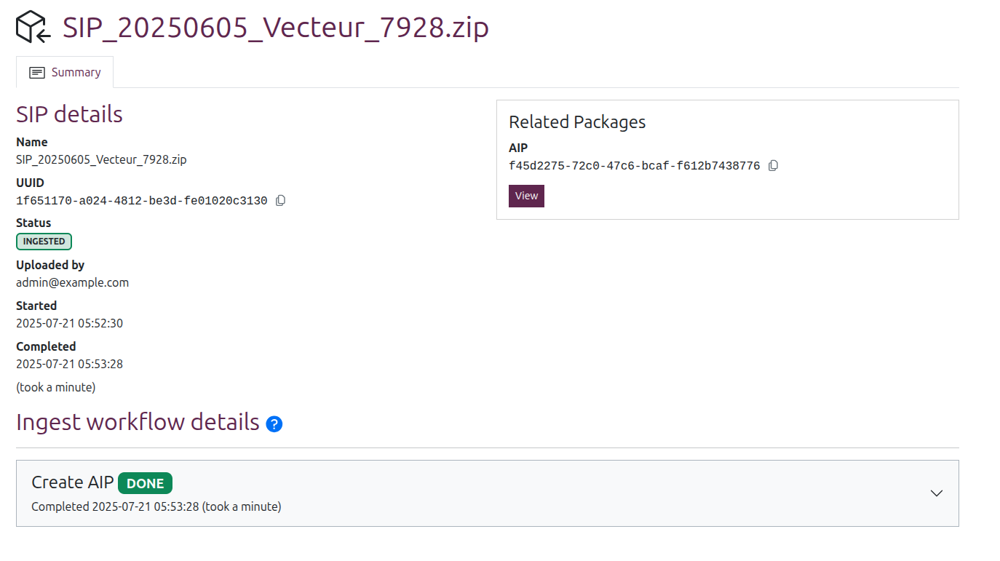
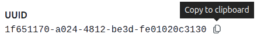
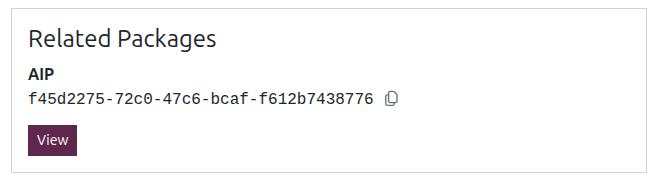
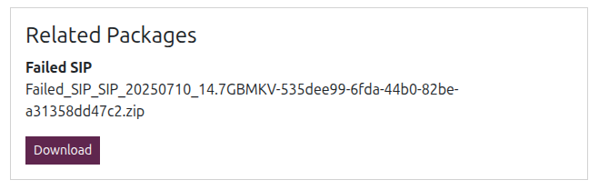
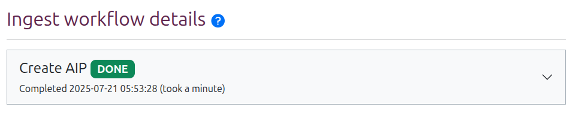
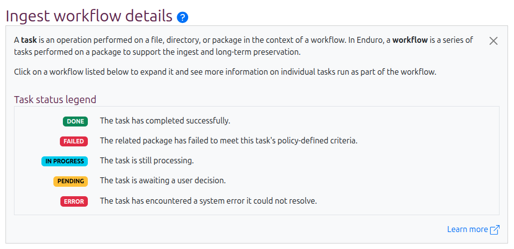
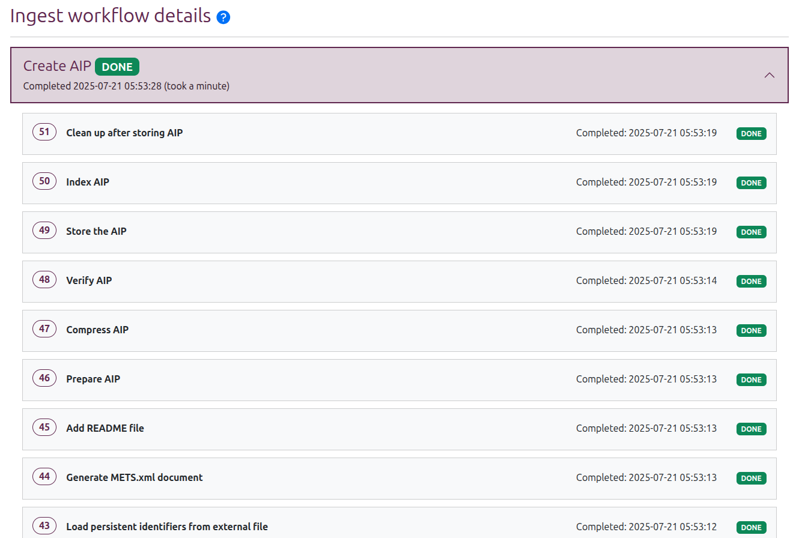
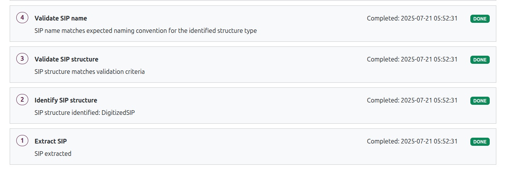
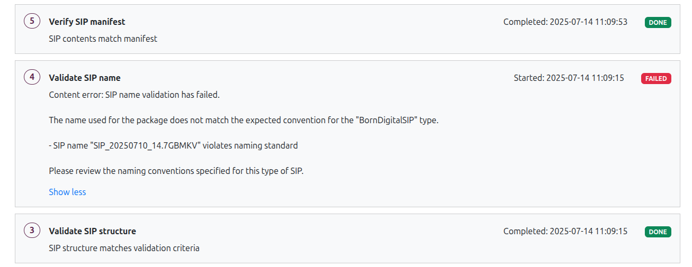

# Managing ingest workflows

Everything you need to know to manage SIP ingests after they are uploaded

-----

## SIP view pages

The SIP view page provides a high-level overview of a given SIP and any ingest
workflows that have been and their outcome. Additionally, any
[related packages](#related-packages) derived from the SIP during processing are
linked as well.

The page title will be the SIP name. The SIP UUID is used to construct the page
URL. The page is then organized into 3 main sections:

* [SIP details](#sip-details)
* [Related packages](#related-packages)
* [Ingest workflow details](#workflows-and-activities)

### SIP details

SIP details are found in the body of the SIP view page. This section provides a
few high-level metadata elements about the SIP and its ingest, including:

* **Name**: Name of the SIP at ingest time. Should match the page title.
* **UUID**: The unique identifier associated with the SIP. Either extracted from
  the SIP metadata, or assigned by Enduro if no existing UUID is found.

!!! tip

    You can quickly copy the UUID by clicking the icon to the right of it

     

* **Status**: The status of the SIP. Uses the [same statuses as those shown on
  the SIP browse page.](search-browse.md#sip-statuses).
* **Ingested by**: The user associated with initiating the SIP ingest. How user
  information displays in this field depends on whether authentication is
  enabled and what information is available from the provider - for more
  information, see:
  [User filters and authentication configuration](../overview.md#user-filters-and-authentication-configuration).
* **Started**: Timestamp of when the ingest workflow started.
* **Completed**: Timestamp of when the ingest workflow ended. An estimate of the
  total time of the ingest will also be shown below in parentheses.

!!! tip

    Internally, Enduro will store timestamps in Coordinated Universal Time, i.e.
    [UTC](https://en.wikipedia.org/wiki/Coordinated_Universal_Time). However,
    the user interface will then render those timestamps based on your browser's
    or operating system's configured timezone settings.

### Related packages

The related packages widget, on the right side of the SIP view page, shows any
packages derived from the original upload during the ingest. This can include:

**Related AIPs**: If the ingest is successful, one or more AIPs will be created
following ingest, depending on the ingest workflow activities.

You can click the "View" button to go to the related AIP view page, where the
AIP can be downloaded, deleted, and otherwise managed.

**Failed SIPs**: Alternatively, if the SIP encounters either a [content failure]
or a [system error] during the ingest workflow, a copy of the SIP at the time of
failure, with `Failed_SIP_` appended to its name, will be shown instead. You can
click the "Download" button to download a local copy of the failed SIP for
inspection and/or fixes before reattempting ingest.

## Workflows and activities

The bottom half of the SIP view page contains the **Ingest workflow details**. A
card with summary information about the ingest workflow will be shown here,
including:

* Workflow name
* Workflow status
* Completed timestamp (with an estimated duration next to it)

Click anywhere on the header card to expand it and see more information about
[the tasks run](#workflow-tasks) as part of the workflow.

### Workflow task status legend

Both [workflows][workflow] and their component [tasks][task] have a controlled
vocabulary of **statuses** that can tell you more about the current state or
outcome of a given process.

Clicking the blue "( ? )" question mark icon next to the Ingest workflow details
header will reveal a legend explaining the various task statuses and their
meaning:

**Workflow tasks** can have the following statuses:

* **DONE**: The task has completed successfully
* **FAILED**: The related package has failed to meet this task's policy-defined
  criteria
* **IN PROGRESS**: The task is still processing
* **PENDING**: The task is awaiting a user decision
* **ERROR**: The task has encountered a system error it could not resolve
* **QUEUED**: The task is waiting to start
* **UNSPECIFIED**: The task has not yet reported a status

**Workflows** have their own status as well. Most of these are similar to the
task statuses, with a few additional statuses:

* **QUEUED**: The workflow is waiting for an available worker to begin
* **CANCELED**: The workflow has been canceled by a user

!!! tip

    SIPs also have their own statuses. See: [SIP statuses](search-browse.md#sip-statuses)

#### Errors vs failures

To help operators better understand the cause of an unsuccessful workflow,
Enduro uses different statuses for a [content failure] and a [system error].

When an ingest task provided by Enduro fails validation because some element of
the submitted content (e.g. SIP structure, metadata, files, etc) does not match
the criteria defined in the workflow task, this is a **content failure**, and
the related task will have a **FAILED** status. When the workflow finishes
running as far as it can, it will then be given the same failed status.

These issues are generally ones that can be fixed by the original producer or by
an Enduro operator, as they relate to the contents and structure of the SIP, and
not the system itself. Producers and/or operators can then choose to:

* Download the failed package from the [Related packages](#related-packages)
  widget
* Use the details shown in the related
  [workflow task](#workflow-tasks) to better understand the issue
* Identify and fix the issue in the SIP
* Resubmit the SIP for ingest

Conversely, Enduro will use an **ERROR** status when a **system error**
interrupts one or more ingest tasks provided by Enduro, causing the workflow to
halt. This might be due to network interruptions, disk space issues, hardware
malfunctions, or software bugs - generally, a system administrator will be
needed to resolve the issue upstream before ingest can be tried again.

Enduro uses the structured result returned by the preprocessing and poststorage
[child workflows] to decide whether ingest continues, fails, or enters an error
state.

#### Pending tasks and workflows

A **PENDING** task or workflow means that all workflow activity is paused,
**waiting for input** from an operator before proceeding.

In such cases, buttons allowing an operator to input a decision are generally
provided and the workflow remains paused until input is received. For example, a
package deletion request initiated by an operator might then show "Approve" and
"Deny" buttons in the workflow details header.

A preprocessing child workflow can also request a human decision.

### Workflow tasks

A workflow is a sequence of tasks managed by Enduro. The **Ingest workflow
details** area lists all workflows run against a package in reverse
chronological order, with the most recent first.

Click anywhere on the **workflow header card** to expand it and see a list of
all tasks run as part of that workflow. Tasks are also listed with the most
recent first.

Tasks shown in this area include ingest tasks performed by Enduro, tasks run by
the configured [preservation engine] if the SIP passes initial validation and
transformation, and task records returned by configured preprocessing and
poststorage child workflows.

Returned child workflow tasks appear only after the child finishes. A pending
decision task created by Enduro is the exception: it is visible while a
preprocessing child waits for an operator's response. Postbatch child workflows
do not add tasks to the Enduro interface.

Task rows include:

* A **task number** assigned by Enduro, indicating the order the task was run in
  the workflow
* The **task name** in bold, helping to explain what activity is being performed
* A **status** - see [above](#workflow-task-status-legend) for details on each
  task status meaning
* A **time** - "**Ended**" shows when the task ended whenever a completion
  timestamp is available, regardless of whether its status is done, failed, or
  error. Otherwise, "**Started**" shows when the task began. A dash is shown if
  neither timestamp is available

Enduro ingest tasks also include a description of the **task outcome**:

### Errors and failed package downloads

If one of the validation tasks provided by Enduro **fails** or encounters an
**error**, Enduro will attempt to continue running any remaining validation
tasks to gather as much information about the SIP as possible, but will
terminate the workflow before transforming the package and delivering it to the
[preservation engine].

The **task details** will then provide operators with additional context on the
problem encountered.

If desired, you can then download the SIP from the [Related packages
widget](#related-packages) to inspect it.

## Default ingest workflow

Enduro's default ingest workflow can receive and unpack SIPs, validate included
[BagIt bags][bag], and then restructure and deliver the package for
preservation with either [Archivematica][Archivematica] or [a3m][a3m]. An
organization can add **[child workflows]** to meet its own ingest needs.

Developers can start with the [custom-enduro-workflows] template and use the
[SFA workflows] or [CVA workflows] as examples used in production. Reusable Go
activities are available from [temporal-activities].

The following sections describe the default "Create AIP" workflow and its
optional child workflow extension points.

### Receive SIP

There are multiple ways that Enduro can be configured to receive SIPs - see
[Submitting content for ingest] for more information.

If a SIP ingest is initiated via the user interface, either via
[user interface upload] or selected from a [SIP source location], Enduro will
use the [bucketdownload] Temporal activity to retrieve the SIP. Otherwise, if
the SIP is ingested via [watched location], Enduro instead uses an internal
download activity to fetch the SIP for internal processing.

### Run a preprocessing child workflow

After downloading the SIP, Enduro performs its initial checks. For a SIP that
is not a directory, Enduro determines its file extension, calculates its
checksum, and checks for duplicates if duplicates are not allowed. The
preprocessing `extract` setting then controls Enduro's archive extraction step.
With the default value, `false`, Enduro attempts extraction before it starts the
child. With `true`, Enduro skips the step and the child receives the original
download.

Enduro next checks whether a preprocessing child workflow is configured. It
starts the child before [determining the SIP type](#classify-sip-type). A custom
workflow can validate the SIP against profiles defined by the organization and
perform other preparation before preservation processing.

The custom workflow, rather than Enduro configuration, determines which
Temporal Activities it schedules and in what order. Enduro waits for the child
result and saves its returned task records. The result outcome determines what
happens next; only a successful result supplies the path and metadata used by
later processing.

!!! important

    A successful preprocessing child workflow must return a path to a valid
    BagIt bag for Enduro to use as the [PIP]. See the
    [preprocessing package requirements](../../dev-manual/child-workflows/preprocessing.md#shared-path)
    for the shared path and extraction contract. A custom worker can reuse the
    [bagcreate] activity to create the bag.

### Classify SIP type

This is a high-level identification of the SIP type into 3 possible types:

* Unknown
* Standard Archivematica transfer
* BagIt bag

If a preprocessing child workflow is configured and the SIP type is **not**
"BagIt bag," Enduro will also fail the workflow (see
[above](#run-a-preprocessing-child-workflow) for an explanation why).

If the type found *is* a bag, Enduro will then validate the bag against the
[BagIt specification][bag], using the [bagvalidate] Temporal activity. If the
bag is not valid, then once again Enduro will fail the workflow.

### Prepare package for preservation engine

The next set of related activities are where Enduro transforms the SIP into what
Enduro calls a **"Processing Information Package" or [PIP]**. A PIP is a
transitional package state in the preservation workflow intended to standardize
inputs to the preservation engine, and not a package type that Enduro operators
will typically interact with directly. Enduro gives it a distinct name simply to
indicate that the original SIP structure may be changed during this phase to
optimize preservation processing.

First, if PREMIS validation is enabled in Enduro's configuration file, Enduro
will check for a `premis.xml` file in the SIP. If one is found, Enduro will
validate the file against the PREMIS 3 schema using the [xmlvalidate] Temporal
activity.

Next Enduro will check the SIP type from the [previous
activity](#classify-sip-type). To ensure integrity during system transfers,
Enduro uses bags for package delivery to the [preservation engine], so content
can be validated upon receipt to ensure nothing changed or corrupted during the
transfer. If the SIP type is **not already a bag**, then Enduro will use the
[bagcreate] Temporal activity to bag the SIP following the
[BagIt specification][bag].

Then, depending on your configuration settings, Enduro may ZIP the package using
the [archivezip] activity. Finally, another activity is used to upload the
PIP to the configured transfer source location in the preservation storage
service (i.e. the Archivematica Storage Service or [AMSS]), and Enduro sends an
API request to the preservation engine to initiate preservation processing.

### Poll preservation for updates

At this point, the [preservation engine] will receive the [PIP] and perform a
series of preservation tasks on the package and its contents. For more
information on the types of activities that [Archivematica] and [a3m] run during
preservation processing and how operators can customize preservation workflows,
consult the [Archivematica documentation].

While this occurs, Enduro will regularly poll the preservation engine for
updates, waiting for a completed status update to be returned. If the status
returned is an error, Enduro will update both the
[SIP status](search-browse.md#sip-statuses) and the ingest
[workflow status](#workflow-task-status-legend) to **ERROR** and then terminate
the workflow.

!!! note

    There are several activities in [Archivematica] that by default pause and
    wait for user input before proceeding. These can be automated via processing
    configuration - consult the [Archivematica documentation] for more
    information.

    While polling for status updates, **if Enduro receives a status update of
    "USER INPUT"** (indicating that preservation processing is paused waiting
    for user input), **Enduro will throw an error and abort the ingest
    workflow.**

### Record storage location

Once Enduro receives a "completed" status update from the [preservation engine],
the application will then register the AIP in Enduro's storage component. The
process is a bit different depending on the preservation engine used.

With [Archivematica], Enduro records the storage details for display in its
interface. With [a3m], Enduro first uploads the AIP to the configured storage
location and then records its storage details.

### Run a poststorage child workflow

When configured, Enduro starts a poststorage child workflow after the AIP is
stored and waits for its result. The workflow can send metadata or
notifications, or perform other integrations. A content or system failure can
mark the SIP ingest as failed or in error, but does not remove the stored AIP.

### Perform final cleanup

Finally, Enduro will attempt to clean up any artifacts left from processing, and
will update the SIP, AIP, and workflow statuses as the workflow finishes.

Any copy of the [PIP] left in the preservation engine's transfer source location
is deleted, and Enduro's own internal processing directories are also purged. If
a retention period has been configured, Enduro will start a workflow activity to
clean up the related object stores when the configured time period expires.

If the ingest workflow encountered a [content failure] or [system error], this
is when a copy of the failed SIP or PIP is uploaded to the configured failed
packages location, so that it can be
[downloaded by an operator](#errors-and-failed-package-downloads) if desired.

Enduro will then update all entity statuses (SIP, AIP, workflow) and terminate
the workflow.

[a3m]: https://github.com/artefactual-labs/a3m
[AMSS]: https://www.archivematica.org/docs/storage-service-latest/
[Archivematica]: https://archivematica.org
[Archivematica documentation]: https://www.archivematica.org/docs/latest/
[archivezip]: https://github.com/artefactual-sdps/temporal-activities/blob/main/archivezip/README.md
[bag]: https://www.rfc-editor.org/rfc/rfc8493
[bagcreate]: https://github.com/artefactual-sdps/temporal-activities/blob/main/bagcreate/README.md
[bagvalidate]: https://github.com/artefactual-sdps/temporal-activities/blob/main/bagvalidate/README.md
[bucketdownload]: https://github.com/artefactual-sdps/temporal-activities/tree/main/bucketdownload
[child workflows]: ../glossary.md#child-workflow
[content failure]: ../glossary.md#content-failure
[custom-enduro-workflows]: https://github.com/artefactual-sdps/custom-enduro-workflows
[CVA workflows]: https://github.com/artefactual-sdps/cva-enduro-workflows
[PIP]: ../glossary.md#processing-information-package-pip
[preservation engine]: ../glossary.md#preservation-engine
[SFA workflows]: https://github.com/artefactual-sdps/sfa-enduro-workflows
[SIP source location]: submitting-content.md#initiate-ingest-using-sips-uploaded-to-a-source-location
[Submitting content for ingest]: submitting-content.md
[system error]: ../glossary.md#system-error
[task]: ../glossary.md#task
[temporal-activities]: https://github.com/artefactual-sdps/temporal-activities
[user interface upload]: submitting-content.md#upload-sips-via-the-user-interface
[watched location]: submitting-content.md#initiate-ingest-via-a-watched-location-upload
[workflow]: ../glossary.md#workflow
[xmlvalidate]: https://github.com/artefactual-sdps/temporal-activities/blob/main/xmlvalidate/README.md
