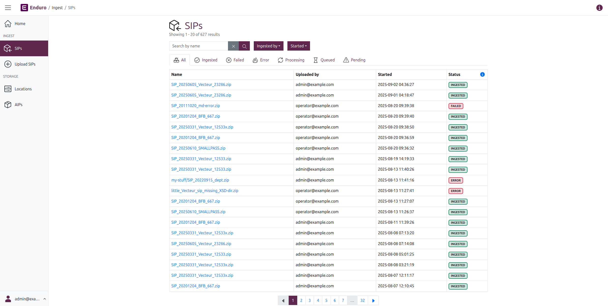
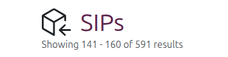
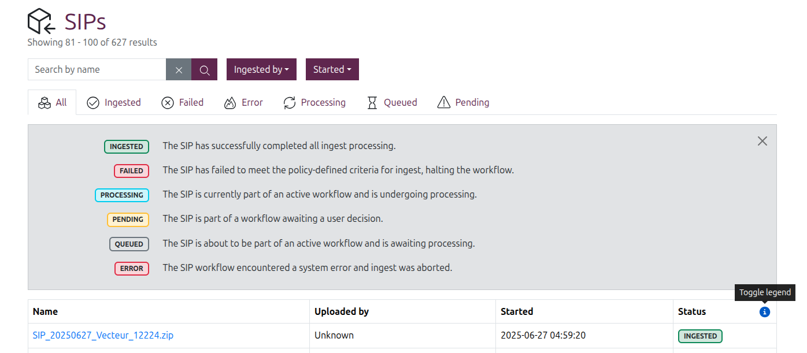
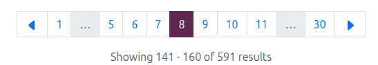
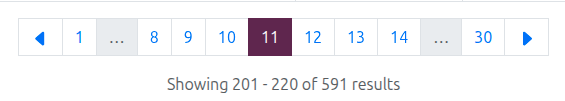
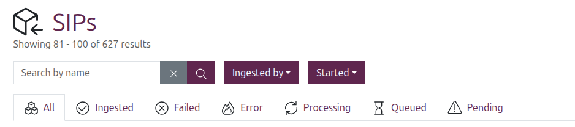
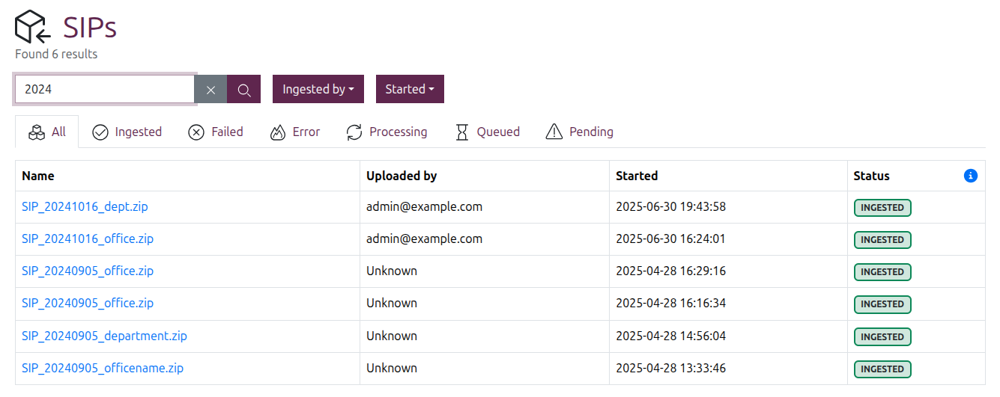
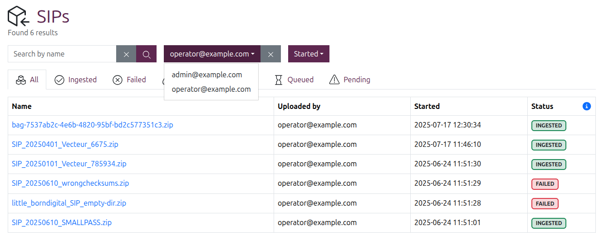
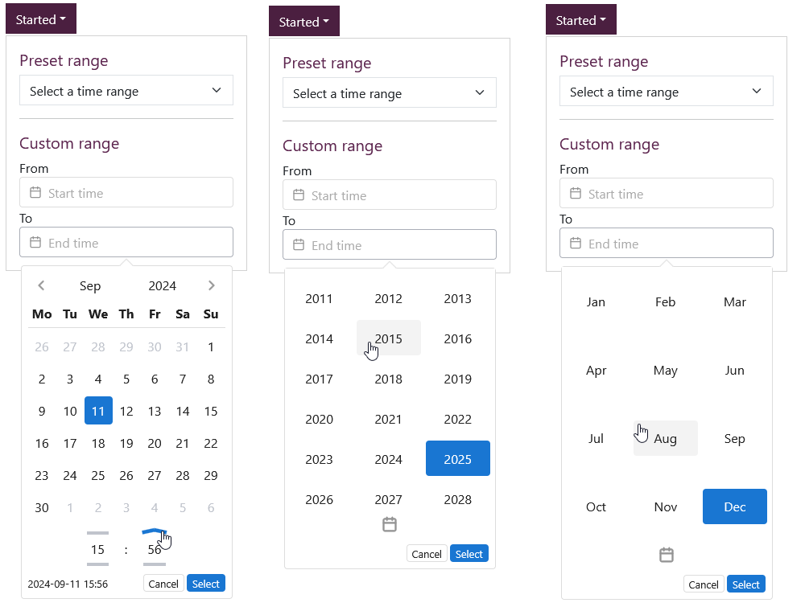

# Searching and browsing

Everything you need to know about SIP discovery in Enduro

-----

## SIP browse page

You can navigate to the SIP browse page from anywhere in the application by
clicking the "SIPs" link in the [navbar] on the left side of the screen. Enduro
will then redirect you to the SIP browse page:

### Browsing results

By default, the SIP browse page will show 20 results per page. If you have
ingested more than 20 SIPs, a [pager](#using-the-pager) will be included at the
bottom of the page, with a results count listed beneath it. A list of the
current and total SIPs is also included at the top of the page, beneath the page
title.

{width="400px"}
/// caption
The SIP browse page includes a count of results at the top and bottom of the page
///

SIP results are presented in a table with the following columns:

* **Name**: The name of the SIP.
* **Uploaded by**: The user associated with initiating the SIP ingest by
  uploading the package. How user information displays in this field depends on
  whether authentication is enabled and what information is available from the
  provider - for more information, see:
  [User filters and authentication configuration](../overview.md#user-filters-and-authentication-configuration)
* **Started**: The timestamp of when the related ingest workflow began.
  Internally, Enduro will store timestamps in Coordinated Universal Time
  ([UTC]). However, the user interface will then render those timestamps based
  on your browser's or operating system's configured timezone settings.
* **Status**: The current [status](#sip-statuses) of the SIP.

### SIP statuses

Clicking the blue **( i ) info icon** to the right of the "Status" column header
in the browse results will display the **SIP status legend**:

SIPs can have the following statuses:

* **INGESTED**: The SIP has successfully completed all ingest processing
* **FAILED**: The SIP has failed to meet the policy-defined criteria for ingest,
  halting the workflow
* **PROCESSING**: The SIP is currently part of an active workflow and is
  undergoing processing
* **PENDING**: The SIP is part of a workflow awaiting a user decision
* **QUEUED**: The SIP is about to be part of an active workflow and is awaiting
  processing
* **ERROR**: The SIP workflow encountered a system error and ingest was aborted

!!! tip

    Workflows and tasks also have their own statuses - see the
    [Managing ingest workflows](managing-ingest-workflows.md#workflow-task-status-legend)
    page.

### Using the pager

The **pager** is a navigational user interface widget that is shown on any
browse page with more than 20 results.

{width="450px"}
/// caption
An example of a pager on the SIP browse page
///

The **current page** will be shown in purple. The pager will show up to 6 other
active pages as white with blue hyperlink numbering - click any of these to
navigate to that page of results.

You can also click on the **< Back** and **> Forward** arrows on each end
of the pager to navigate to the previous or next page. If either of these icons
are shown in  grey, this means they are inactive - there are no further results
in that direction.

Enduro will also include grey **... ellipses** to indicate that there are
additional pages between the currently enabled adjacent results and the first or
last results (as shown after page 1 and before page 30 in the image above).
These indicate that more page results are available between the two active
pages. Click on one of the adjacent active pages to show those page results in
the pager.

For example, to access page 14 in the pager shown above: click on page 11. Now
pages 12-14 are active and can be clicked:

{width="450px"}
/// caption
When page 11 is clicked, pages 12-14 are now shown
///

Some intermediate pages may require multiple clicks to access. For example,
getting to page 23 of the results might mean first clicking page 30 and then
page 24 before page 22 is available in the active pages shown.

## Searching and filtering

The SIP browse page also includes a basic SIP search box and some filters that
can be applied to limit the results shown.

### SIP search

To perform a search, enter a term in the search box and then either press enter
or click the purple button with the magnifying glass icon. Once entered, the
count of results at the top of the page will update based on the outcome of the
search.

Clicking the grey button with the **X** icon will clear the search box and
refresh the results.

Currently, the SIP search will **only** search against SIP names. Enduro will
return matches from **any part of the name** - so for example, searching for
`star` would return titles that include "start," but also "restarting,"
"morningstar," etc.

!!! important

    Searches are **CASE SENSITIVE**. Meaning a search for `FEB` would return
    SIPs whose names include "FEBRUARY" but not "February," "feb," or any other
    casing variant.

    If you are not sure of the results you're seeking in advance, you may want
    to try your search with different casings to ensure you've found all
    relevant results!

### Filter by SIP status

SIP browse results can be filtered by status by clicking on one of the tabs
shown above the results table. By default Enduro will show all results.

Clicking on one of the other tabs will immediately limit the results to those
SIPs with a matching [status](#sip-statuses), and the result count at the top
of the page will also update.

!!! tip

    To help operators better understand the cause of an unsuccessful workflow,
    Enduro uses different statuses for a
    [content failure](../glossary.md#content-failure) and a
    [system error](../glossary.md#system-error). For more information, see:

    * [Errors vs failures](managing-ingest-workflows.md#errors-vs-failures)

### Filter by uploader

If [authentication is enabled][iac], you can also filter SIP browse results by
who initiated the ingest. Click the purple "Uploaded by" button to show the
drop-down menu with available user options.

Options shown in this drop-down may be a mix of names, emails, and even UUIDs,
depending on what user properties are available from the authentication
provider. For more information on how Enduro tries to display uploader
information, see:
[User filters and authentication configuration](../overview.md#user-filters-and-authentication-configuration).

!!! note

    If authentication is not enabled and/or the identity of the uploader cannot
    be known, Enduro will simply show "Unknown" in the _Uploaded by_ results
    column.

    At this time, "Unknown" is **not** included as a filter option.

When applied, the username (or email, etc) will display in the purple button,
showing that the filter is applied. The results will update immediately, as will
the count of results at the top of the page.

You can click the grey **X** button on the right of the button to clear the
applied filter.

### Filter by ingest start time

SIP browse results can also be filtered by the time the ingest workflow started.

Click the "Started" filter button to reveal the drop-down menu and configuration
options. The filter includes a number of preset time ranges, as well as the
option to enter a custom range.

The **preset start time range options** include:

* The last 3 hours
* The last 6 hours
* The last 12 hours
* The last 24 hours
* The last 3 days
* The last 7 days

To **apply one of the preset ranges**, simply click the "Select a time range"
drop-down and select one of the values. The "Started" filter button text will
update to show your selected time range, and the results will be filtered
immediately.

Alternatively, **to configure a custom range**, use the "From" and "To" fields
in the drop-down menu. Clicking into either field will display a calendar widget
that can be used to configure your time range.

In the calendar widget you can click on:

* Any **date** in the calendar to select a day
* The **month** shown at the top of the calendar, to reveal a month picker
    * Alternatively, you can use the **< Back** and **> Forward** arrows to
      shift the displayed calendar forward or back by one month
* The **year** shown at the top of the calendar, to reveal a year picker
* The **hour** or **minutes** shown below the calendar, to show pickers for
  these
    * Alternatively, hovering over the **lines above and below** the time
      elements reveals them to be up and down arrows - click these to increment
      the time forward or back

/// caption
The calendar widget provides a number of different ways to configure your range
///

As you configure your range, a preview is shown in the bottom left corner of the
calendar widget. You can click "Cancel" to clear all previous selections and
close the calendar widget, or click the "Select" button in the bottom right of
the widget to finalize your range.

!!! tip

    You don't have to configure both "From" and "To" fields to filter results.
    For example, to see all SIPs ingested since the start of the year, you can
    set the "From" field to January 1 of the current year, and leave the "To"
    field empty.

Once your range is configured, the Started filter button text will display the
word "Custom" to indicate that a custom range is applied, and results will be
filtered immediately.

[iac]: ../../admin-manual/iac.md
[navbar]: ../overview.md#navigation
[UTC]: https://en.wikipedia.org/wiki/Coordinated_Universal_Time
