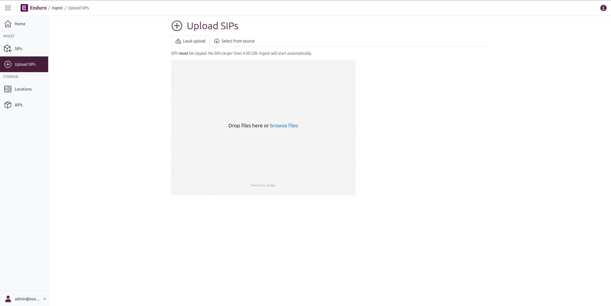
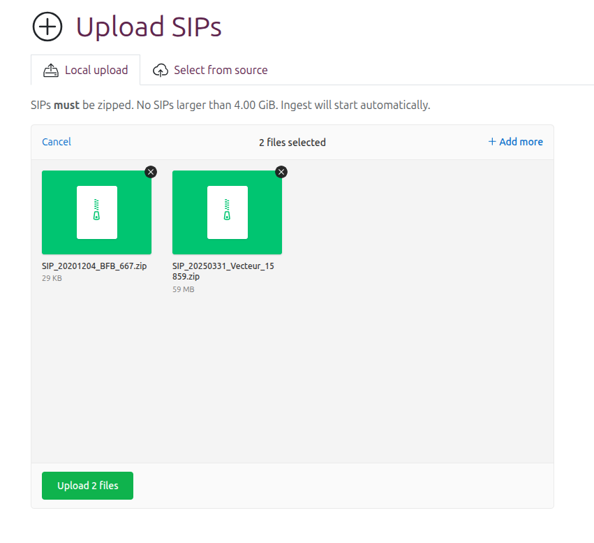
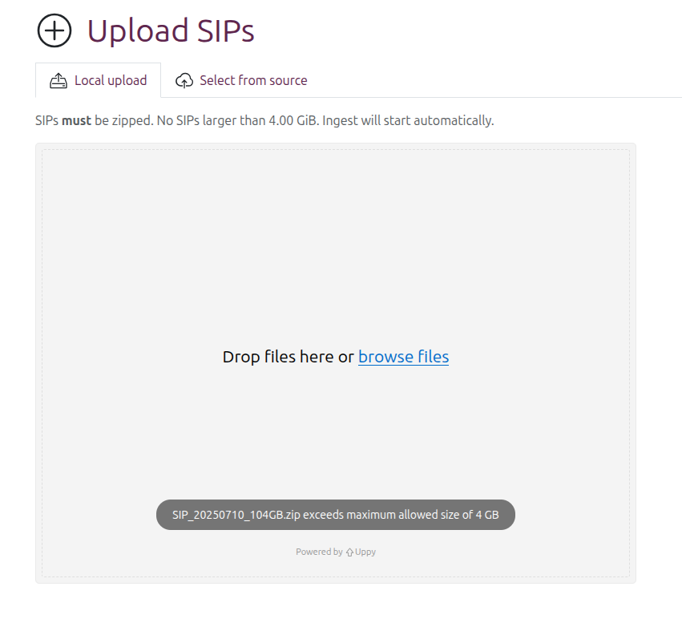

# Submitting content for ingest

Depending on how Enduro is configured during installation, there are several
different ways that operators can initiate an ingest workflow. Currently, in all
cases Enduro needs one or more
[SIPs](../glossary.md#submission-information-package-sip) to initiate an ingest
workflow. Below are instructions on the 3 different ways that operators can
submit SIPs for ingest in Enduro.

## Prepare digital objects

Digital objects and their metadata can be packaged in a few different ways for
upload to Enduro. [a3m][a3m] and [Archivematica][Archivematica] are both
format-agnostic preservation engines, meaning that they can accept any file you
pass for processing. A single SIP can be homogenous or it can be a mix of many
different file formats. In all cases, the digital objects **must** be packaged
together as either a `.zip`, `.tgz`, or `.tar.gz`.

a3m reuses two of the transfer types from Archivematica - zipped directory and
zipped bag. a3m will automatically recognize the transfer type and adjust its
processing workflow accordingly.

* **Zipped directory**: digital objects that have been packaged together using
  the `.zip`, `.tgz`, or `.tar.gz` packaging format. When a zipped directory
  transfer starts, the zip will be unpacked. The internal structure of a zipped
  directory transfer can either be a loose collection of files, or it can
  include structures like a metadata directory.

* **Zipped bags**: digital objects that have been packaged according to the
  [BagIt File Packaging Format][BagIt], colloquially known as bags. Bags must be
  packaged together using the `.zip`, `.tgz`, or `.tar.gz` packaging format.
  Enduro will validate the bag early on in the ingest workflow, looking at
  manifest information created during the bagging process such as checksums and
  the payload oxum.

For more information on how a3m/Archivematica implement the BagIt specification,
please see [Unzipped and zipped bags][Unzipped and zipped bags]
in the Archivematica documentation.

## Upload SIPs via the user interface

Enduro includes an upload page that allows operators to upload SIPs for ingest
directly via the web browser. A system administrator can define a **package
upload size limit** via configuration - when configured the browser will check
the package size upon submission and return an error to the operator if the
package exceeds the configured limit.

**To upload SIPs via the user interface**:

1. Using the [navbar](../overview.md#navigation) on the left side of the screen,
   click on "Upload SIPs." Enduro will redirect you to the SIP upload  page.

    

2. For upload via the user interface, make sure the tabs at the top of the page
   are set to display the "Local upload" option.

    !!! warning

        SIPs **must be zipped** to be uploaded via the user interface. A
        reminder of this and the configured upload limit will be displayed above
        the upload widget.

3. You can either drag and drop packages from your local computer into the grey
   **upload staging area**, or click the "browse files" link in the upload area
   to open a file explorer.

    !!! tip

        Multiple SIPs can be uploaded at once (up to the upload limit defined on
        the page), but once ingest is initiated, each SIP will be part of its
        own separate ingest workflow.

4. Upload using this method is 2-staged. After a SIP is added, it will be shown
   in the upload staging area as a green ZIP package, with minimal metadata
   showing the package name and size.

    

 5. At this point, you can:

    * Click the **X** icon next to any SIP to remove it from the upload staging
      area
    * Add additional packages for ingest, either by:
        * Dragging and dropping more SIPs for ingest directly into the staging
          area, or
        * Clicking the "+ Add more" link in the top-right corner of the upload
          widget
    * Cancel the ingest and clear all staged packages by clicking the "Cancel"
      link in the top-left corder of the upload widget
    * **Start the ingest** of SIPs already in the staging area, using the green
      button at the bottom of the upload widget

    !!! note

        Navigating away from the upload page at this point will also cancel the
        ingest and clear the staging area.

6. If a package that exceeds the configured upload limit is added, instead of
   showing it in the staging area, Enduro will display a warning, even if there
   are already packages in the staging area:

    

**Starting ingest**

6. When you're finished adding SIPs, you can now start ingest by **clicking the
   green button** at the bottom of the upload widget.

7. After a moment, the page will reload and you will be redirected to the SIP
   browse page, where any new worklfows started by the upload  will be visible
   at the top of the browse results. Each SIP uploaded will be ingested via its
   own separate workflow.

## Add SIPs via a source location

Coming soon!

## Initiate ingest via a watched location upload

It is also possible to configure Enduro to use a watched location for ingest.
This must be configured by a system administrator first. The configured watched
location can either be a local filesystem directory or an object store bucket
(such as one provided by MinIO, S3, or Azure).

Once configured, any time a new zipped package is added to the location,
Enduro's [messaging queue][mq] will see it and automatically initiate an ingest
workflow.

The example below will use [MinIO][MinIO] - details may vary depending on the
type of watched location used.

!!! note

    Packages **must** be zipped to be properly ingested into Enduro.

**Example - Upload via MinIO**

1. In MinIO, navigate to the Object Browser and select your upload bucket. In
   this example, the upload bucket is called `sips`.

    

2. Click on **Upload** and then select **Upload file**. This will open a file
   browser.

    

3. In the file browser, locate your SIP and upload it to MinIO.
   Once the progress bar has completed, Enduro will begin ingesting the SIP.

[a3m]: https://github.com/artefactual-labs/a3m
[Archivematica]: https://archivematica.org
[BagIt]: https://tools.ietf.org/html/rfc8493
[MinIO]: https://min.io/
[mq]: ../components.md#messaging-queue
[Unzipped and zipped bags]: https://www.archivematica.org/docs/latest/user-manual/transfer/bags/#bags