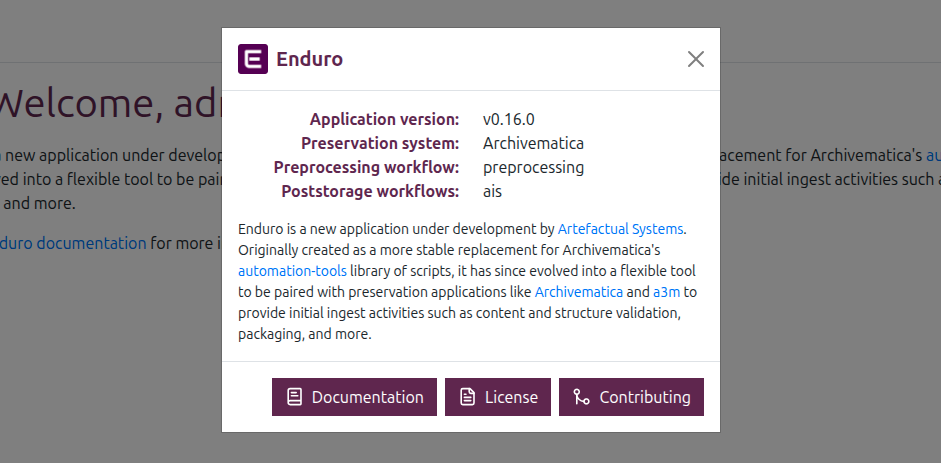

# Overview and getting started with Enduro

[Enduro][Enduro] is a new application under development by [Artefactual
Systems]. Designed following digital preservation standards and best practices,
our goal with Enduro is to ensure records of the past can be cared for in the
present and trusted in the future. The application borrows terminology from the
digital preservation domain - a full glossary of terms and how we define them in
the Enduro project can be found at:

* [Glossary](glossary.md)

Originally created as a more stable replacement for Archivematica’s
[automation-tools][automation-tools] library of scripts, Enduro has since
evolved into a flexible tool to be paired with preservation applications to
provide initial ingest activities such as content and structure validation,
packaging, and more. To learn more about the components that make up Enduro,
see:

* [Components](components.md)

Below you'll find basic instructions on how to login to the application and an
overview of some of the first pages you will encounter. While the Enduro user
interface provides a single seamless experience for operators, behind the scenes
the code is organized into functional modules based on different stages of the
digital preservation lifecycle. Currently these include:

* [Ingest](ingest/index.md)
* Storage

## Logging in

Depending on the [installation process], the application can be configured to
require no authentication. However, Enduro optionally supports external OpenID
Connect (OIDC) compatible providers for authentication and access control. Users
can authenticate against the external provider from the dashboard - if
authentication has been enabled, then when first arriving, users will see a
sign-in button:

When clicked, users will be redirected to the provider's authentication page.
After successfully submitting valid credentials, users will then be redirected
back to Enduro's landing page.

Welcome to Enduro!

## Landing page and About widget

The **landing page** is the first thing that operators will encounter after
logging in. It contains a brief introduction to the application, including a
link to the Enduro documentation.

Additionally, clicking the **info icon** in the top right corner of the Enduro
header bar will open an About widget with further information and links,
including the application version, the configured preservation engine, the name
of the workflows in use, and more.

## Navigation

The **Navbar** on the left side of the application is the primary method of
navigation in Enduro. This navbar is available on all pages, and users can
return to the landing page at any time, either by clicking "Home" in the navbar
menu, or by clicking the Enduro logo above the navbar.

As users navigate to different pages using the navbar, the header will show a
**breadcrumb trail** to orient the user. The breadcrumb trail can also be used
for navigation - clickable pages (such as the "SIPs" link in the image below)
are shown in purple, while informational separators that cannot be navigated to
(such as the "Ingest" part of the breadcrumb trail in the image below) are shown
in grey.

The navbar can also be expanded or collapsed to increase screen space. To do so,
click the three lines in the header bar next to the Enduro logo:

{ width="300" }
/// caption
The Enduro navbar, shown in its collapsed and expanded states
///

## Logging out

To logout of Enduro, click the username shown at the bottom of the navbar. This
widget will expand to show a Sign out button - click this to exit the
application:

{ width="300" }
/// caption
The logout button is in the user menu at the bottom of the navbar
///

[Artefactual Systems]: https://www.artefactual.com
[automation-tools]: https://github.com/artefactual/automation-tools
[Enduro]: https://github.com/artefactual-sdps/enduro
[installation process]: ../admin-manual/iac.md