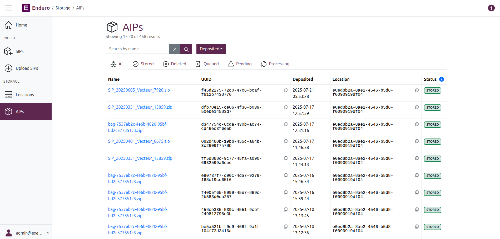
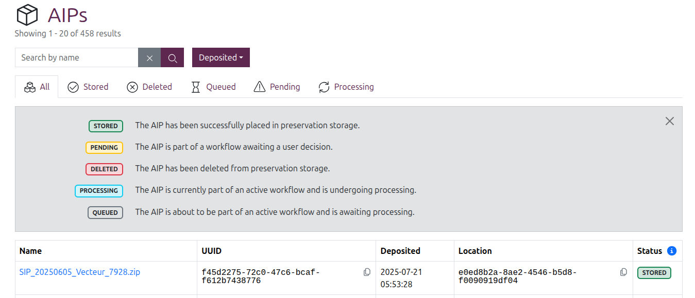
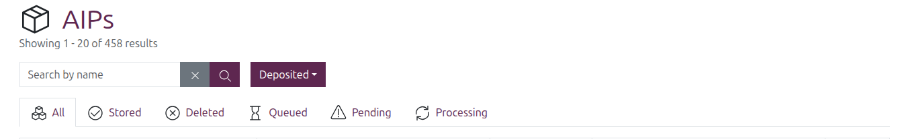
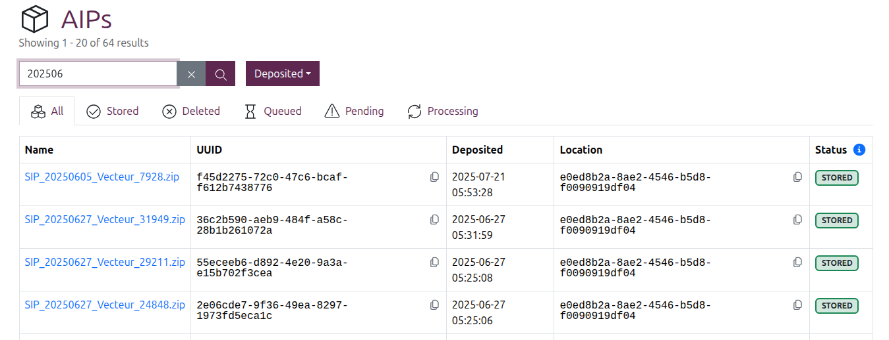

# Searching and browsing AIPs

Everything you need to know about AIP discovery in Enduro

-----

## Browse AIPs

You can navigate to the **AIP browse page** from anywhere in the application by
clicking the "AIPs" menu link under the Storage heading in the [navbar] on the
left side of the screen. Enduro will then redirect you to the AIP browse page:

### Browsing results

By default, the AIP browse page will show up to 20 results per page. A count of
the currently shown and total AIP results will be shown at the top of the page,
beneath the page title.

If you have stored more than 20 AIPs, a [pager] will be included at the
bottom of the page, with a results count listed beneath it. The pager works the
same as it does in the Ingest pages - for more information, see:

* [Using the pager][pager]

AIP results are presented in a table with the following columns:

* **Name**: The name of the AIP. If only 1 AIP was derived from your SIP, then
  the AIP name will be identical to the original SIP's name.
* **UUID**: The unique identifier generated for the AIP during the preservation
  workflow.
* **Deposited**: A timestamp of when the AIP was first stored, following the
  successful conclusion of the preservation workflow. Internally, Enduro will
  store timestamps in Coordinated Universal Time ([UTC]). However, the user
  interface will then render those timestamps based on your browser's or
  operating system's configured timezone settings.
* **Status**: The current [status](#aip-statuses) of the AIP.

### AIP statuses

Clicking the blue **( i ) info icon** to the right of the "Status" column header
in the browse results will display the **AIP status legend**:

AIPs can have the following statuses:

* **STORED**: The AIP has been successfully placed in preservation storage.
* **PENDING**: The AIP is part of a workflow awaiting a user decision.
* **DELETED**: The AIP has been deleted from preservation storage.
* **PROCESSING**: The AIP is currently part of an active workflow and is
  undergoing processing.
* **QUEUED**: The AIP is about to be part of an active workflow and is awaiting
  processing.

!!! tip

    Workflows and tasks also have their own statuses - Enduro uses the same
    controlled vocabulary of statuses for workflows and tasks in both the Ingest
    and Storage domains. For more information, see:

    * [Workflow task status legend](../ingest/managing-ingest-workflows.md#workflow-task-status-legend)

#### DELETED AIP status

It is possible in Enduro for an AIP to be deleted from preservation storage, but
a record of it to remain in in the AIP results.

To ensure accurate audit logging and to maintain the preservation chain of
custody from ingest to final disposition, Enduro will retain a record of deleted
AIPs in its database even after a deletion workflow has been run. After the
deletion workflow has concluded successfully, the AIP will be given a **DELETED
status**, but it will still appear in AIP browse results and have its own view
page.

To see a list of deleted AIPs still listed in Enduro, you can use the
[AIP status filters](#filter-by-aip-status) to limit browse results to show only
deleted AIPs.

#### PENDING AIP status

A **PENDING** status on an AIP means that the package is currently part of an
ongoing workflow, but all workflow activity is currently paused to **wait for
input** from an operator before proceeding. See the Viewing and managing AIPs
page for more information and examples.

An operator can use the [AIP status filters](#filter-by-aip-status) to limit
browse results to show only those AIPs awaiting a user decision.

## Searching and filtering

The AIP browse page also includes a basic AIP search box and some filters that
can be applied to limit the results shown.

### AIP search

To perform a search, enter a term in the search box and then either press enter
or click the purple button with the magnifying glass icon. Once entered, the
count of results at the top of the page will update based on the outcome of the
search.

Clicking the grey button with the **X** icon will clear the search box and
refresh the results.

Currently, the AIP search will **only** search against AIP names. Enduro will
return matches from **any part of the name** - so for example, searching for
`star` would return titles that include "start," but also "restarting,"
"morningstar," etc.

!!! important

    Searches are **CASE SENSITIVE**. Meaning a search for `FEB` would return
    AIPs whose names include "FEBRUARY" but not "February," "feb," or any other
    casing variant.

    If you are not sure of the results you're seeking in advance, you may want
    to try your search with different casings to ensure you've found all
    relevant packages!

### Filter by AIP status

AIP browse results can be filtered by status by clicking on one of the tabs
shown above the results table. By default Enduro will show all results.

Clicking on one of the other tabs will immediately limit the results to those
AIPs with a matching [status](#aip-statuses), and the result count at the top
of the page will also update.

### Filter by AIP deposit time

AIP browse results can also be filtered by the time the AIP was stored.

Click the "Deposited" filter button to reveal the drop-down menu and
configuration options. The filter includes a number of preset time ranges, as
well as the option to enter a custom range.

The **preset start time range options** include:

* The last 3 hours
* The last 6 hours
* The last 12 hours
* The last 24 hours
* The last 3 days
* The last 7 days

To **apply one of the preset ranges**, simply click the "Select a time range"
drop-down and select one of the values. The "Started" filter button text will
update to show your selected time range, and the results will be filtered
immediately.

Alternatively, **to configure a custom range**, use the "From" and "To" fields
in the drop-down menu. Clicking into either field will display a calendar widget
that can be used to configure your time range.

In the calendar widget you can click on:

* Any **date** in the calendar to select a day
* The **month** shown at the top of the calendar, to reveal a month picker
    * Alternatively, you can use the **< Back** and **> Forward** arrows to
      shift the displayed calendar forward or back by one month
* The **year** shown at the top of the calendar, to reveal a year picker
* The **hour** or **minutes** shown below the calendar, to show pickers for
  these
    * Alternatively, hovering over the **lines above and below** the time
      elements reveals them to be up and down arrows - click these to increment
      the time forward or back

/// caption
The calendar widget provides a number of different ways to configure your range
///

As you configure your range, a preview is shown in the bottom left corner of the
calendar widget. You can click "Cancel" to clear all previous selections and
close the calendar widget, or click the "Select" button in the bottom right of
the widget to finalize your range.

!!! tip

    You don't have to configure both "From" and "To" fields to filter results.
    For example, to see all AIPs stored since the start of the year, you can
    set the "From" field to January 1 of the current year, and leave the "To"
    field empty.

Once your range is configured, the Deposited filter button text will display the
word "Custom" to indicate that a custom range is applied, and results will be
filtered immediately.

[navbar]: ../overview.md#navigation
[pager]: ../ingest/search-browse.md#using-the-pager
[UTC]: https://en.wikipedia.org/wiki/Coordinated_Universal_Time
