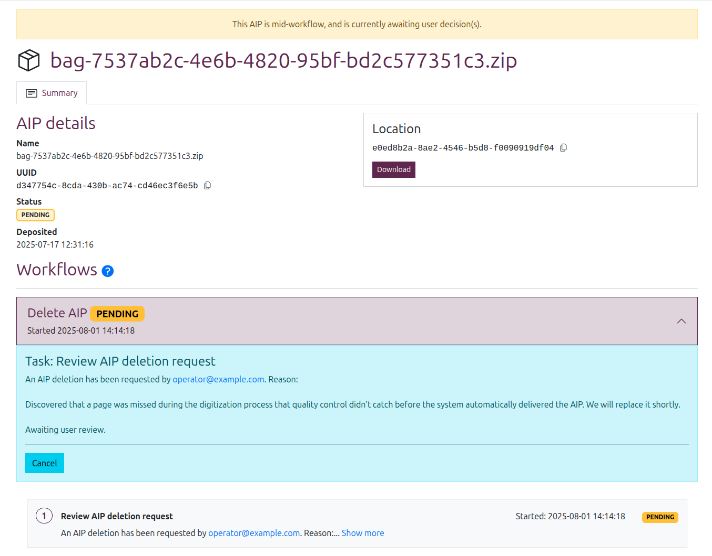

# View and manage AIPs

Everything you need to know about long-term preservation in Enduro

-----

## AIP view pages

The **AIP view page** provides a high-level overview of a given AIP, its status
in Enduro, and its current storage location.

Additionally, if any workflows have been run since the AIP's deposit in the
storage service, Enduro will show related workflows and their outcomes below
the AIP details.

You can navigate to the view page of any stored AIP by finding it listed in the
[AIPs browse page](browse-aips.md) results and then clicking on the hyperlinked
AIP name. Enduro will redirect you to the view page for the selected AIP.

The page title will be the AIP name. The AIP UUID is used to construct the page
URL. The page is then organized into 3 main sections:

* [AIP details](#aip-details)
* [Location widget](#aip-location)
* [Worfklows](#aip-workflows-and-activities)

### AIP details

AIP details are found in the body of the AIP view page. This section provides a
few high-level metadata elements about the AIP, including:

* **Name**: Name of the AIP at deposit time. Should match the page title. Also,
  if only one AIP was derived from the original SIP ingested to create it, then
  the AIP name will be the same as the SIP name.
* **UUID**: The unique identifier assigned to the AIP during preservation.

!!! tip

    You can quickly copy the UUID by clicking the icon to the right of it

     

* **Status**: The status of the AIP. Uses the same statuses as those shown on
  the AIP browse page - see: [AIP statuses](browse-aips.md#aip-statuses).
* **Deposited**: A timestamp of when the AIP was first stored, following the
  successful conclusion of the preservation workflow. Internally, Enduro will
  store timestamps in Coordinated Universal Time ([UTC]). However, the user
  interface will then render those timestamps based on your browser's or
  operating system's configured timezone settings.

### AIP location

The **location widget**, shown on the right side of the AIP view page, lists the
storage location of the current AIP. If the related AIP has been deleted, this
will be indicated in the location widget in addition to the AIP's status:

{width="400px"}
/// caption
The location widget when an AIP has been deleted
///

If the related AIP is still stored (i.e. has **not** been deleted), then the
widget will also include a number of buttons allowing an operator to perform
additional management actions, including:

* [Download](#download-an-aip)
* [Delete](#delete-an-aip)

{width="400px"}
/// caption
The location widget includes additional action buttons when an AIP is stored
///

!!! note

    At this time, the Location UUID is shown instead of its display name. This
    will be fixed in subsequent releases.

### AIP workflows and activities

If any workflows have been run since the AIP's deposit in the storage service,
Enduro will show related workflows and their outcomes below the AIP details in
the **Workflow details area**.

Workflows will be shown in ascending order, with the most recently run workflow
shown at the top.  A card with summary information will be shown for each
workflow that has been run, including:

* Workflow name
* Workflow status
* Completed timestamp (with an estimated duration next to it)

Click anywhere on a header card to expand it and see more information about
[the tasks run](#workflow-tasks) as part of that workflow.

#### Workflow task status legend

Both [workflows][workflow] and their component [tasks][task] have a controlled
vocabulary of **statuses** that can tell you more about the current state or
outcome of a given process.

Clicking the blue **( ? ) question mark icon** next to the Workflow header will
reveal a legend explaining the various task statuses and their meaning:

**AIP Workflow tasks** can have the following statuses:

* **DONE**: The task has completed successfully
* **FAILED**: The related package has failed to meet this task's policy-defined
  criteria
* **IN PROGRESS**: The task is still processing
* **PENDING**: The task is awaiting a user decision
* **ERROR**: The task has encountered a system error it could not resolve

**Workflows** have their own status as well. Most of these are similar to the
task statuses, with a few additional statuses:

* **QUEUED**: The workflow is waiting for an available worker to begin
* **CANCELED**: The workflow has been canceled by a user

!!! note

    To help operators better understand the cause of an unsuccessful workflow,
    Enduro uses different statuses for a content failure and a system error.
    This works the same in both the Ingest and Storage domains. For more
    information, see:

    * [Errors vs failures](../ingest/managing-ingest-workflows.md#errors-vs-failures)

AIPs also have their own statuses. See:
[AIP statuses](browse-aips.md#aip-statuses)

#### Workflow tasks

A workflow is a sequence of tasks managed by Enduro. The AIP **Workflow details
area** will list all workflows that have been run against a given AIP in
ascending order, with the most recent on the top.

Click anywhere on a **workflow header card** to expand it and see a list of
all tasks run as part of that workflow. Tasks are also shown in ascending order,
with the most recent tasks at the top of the list.

Task cards will include:

* A **task number** assigned by Enduro, indicating the order the task was run in
  the workflow.
* The **task name** in bold, helping to explain what activity is being
  performed.
* A **status** - see [above](#workflow-task-status-legend) for details on each
  task status meaning.
* A **timestamp** - if the task has completed, this will list the completed
  timestamp. If the task is still running or if it does not complete
  successfully (i.e. a failure or error), it will show a timestamp of when the
  task started running
* A **task outcome** - a textual description of the activity details in the
  task. This might include a brief summary of the activity, or in some cases
  (such as an [AIP deletion workflow](#delete-an-aip)) it may include a
  user-input reason. If the task was a failure or error, the outcome details
  might include information to assist operators in troubleshooting.

    If a task outcome description is more than one line of text, the text will
    be truncated and a "**Show more**" link will be shown at the end of the
    first line. You can click the link to fully expand the task card and read
    the full description.

#### Pending workflows and tasks

A task and its corresponding workflow are given the **PENDING** status when a
**user decision is needed** to proceed. For example, the
[AIP deletion workflow](#delete-an-aip) requires a second user with appropriate
permissions to review and either approve or deny a deletion request.
Consequently when a task in a workflow is pending, the workflow will pause on
the current task and no further activity will take place until a decision is
input.

An AIP view page will indicate that a workflow is in PENDING status in a number
of ways. First, a **PENDING notification banner** will be shown at the top of
the corresponding AIP view page:

Additionally, the [AIP status](browse-aips.md#aip-statuses) will be updated to
**PENDING** - as will the corresponding workflow status below.

When the affected workflow is clicked and expanded, the details from the related
pending task will be shown at the top of the workflow details, along with any
input buttons required to resolve the decision needed:

!!! note

    If a user does not have sufficient permissions to input the decision
    required by the workflow, the related input buttons will not be shown.

    In some cases, a pending request can be canceled - in such a case, a
    "Cancel" button would be shown in the pending details summary area. The
    option to cancel a pending request is **only** shown to the user who
    initiated the request in the first place.

## Download an AIP

Operators with sufficient permissions can download a copy of an AIP from its
view page.

**To download an AIP**: click the "Download" button shown in the
[locations widget](#aip-location) on the right side of the
[AIP view page](#aip-view-pages). This will initiate a download via your web
browser. Depending on the size of the AIP, this can take a while - your browser
should show the download progress.

{width="400px"}
/// caption
The locations widget can be used to download a copy of an AIP
///

If there is no "Download" button shown under the locations widget:

* Check the [AIP status](browse-aips.md#aip-statuses) in the
  [AIP details area](#aip-details) - the AIP may be deleted, or it may be
  temporarily unavailable for download if it is part of an ongoing workflow.
* You may not have sufficient user permissions to download the AIP - consult
  with an administrator.

!!! note

    For security and to preserve the chain of custody, AIP downloads are
    recorded in Enduro's audit logs.

## Delete an AIP

Operators with sufficient permissions can also permanently delete an AIP from
storage. For security and to prevent accidental deletions, **AIP deletion is a
2-step process**, requiring two different users to fully complete.

**To delete an AIP**: navigate to its [view page](#aip-view-pages), and then
click the "Delete" button shown under the [location widget](#aip-location).

{width="400px"}
/// caption
The location widget can be used to permanently delete an AIP
///

If there is no "Delete" button shown under the locations widget:

* Check the [AIP status](browse-aips.md#aip-statuses) in the
  [AIP details area](#aip-details) - the AIP may already be deleted, or it may
  be temporarily unavailable for deletion if it is part of an ongoing workflow.
* You may not have sufficient user permissions to delete the AIP - consult
  with an administrator.

For security and auditing purposes, Enduro requires the user initiating a
deletion request to enter a reason for the AIP deletion. When you click the
delete button, Enduro will present a pop-up where you can input your reason:

The reason you enter must be **between 10-500 characters**. If there are less
than 10 characters entered Enduro will not let you click the "Request deletion"
button, and when the 500 character limit is reached, the pop-up will not allow
you to type any more.

You can **cancel the deletion request** at this stage by clicking the "Cancel"
button in the request pop-up, or by simply clicking anywhere outside of the
pop-up.

To **submit your deletion request** and start the workflow, click the "Request
deletion" button. Enduro will:

* Immediately update the [workflow status](#workflow-task-status-legend) and
  [AIP status](browse-aips.md#aip-statuses) to **PENDING**
* Display the PENDING **notification banner** at the top of page
* Include your reason in the details summary shown below the workflow header
  when it is expanded, along with a "Cancel" button

### Canceling a deletion request

You can **cancel your own deletion request** by:

* Clicking on the workflow header to expand it and show the tasks and details
  below
* Clicking the "Cancel" button found in the details summary at the top of the
  displayed task list

!!! important

    Only the user who initiates a deletion request can cancel it.

When a deletion request is canceled, the related
[workflow status](#workflow-task-status-legend) will be updated to **CANCELED**,
and the affected [AIP status](browse-aips.md#aip-statuses) will return to
**STORED**. The original reason included with the request and the identity of
the requestor will remain visible in the canceled workflow's details - click
the workflow's header card to expand it and see the tasks listed below:

### Reviewing a deletion request

Once a deletion request is submitted, another user with sufficient permissions
must review it to resolve the PENDING status, either **approving or rejecting**
the request.

!!! important

    You cannot review your own deletion request.

You can find AIPs awaiting a user decision easily from the
[AIP browse page](browse-aips.md#browse-aips) by using the
[AIP status filter](browse-aips.md#filter-by-aip-status) to limit the results to
those AIPs with a **PENDING status**. Click on a result to navigate to its view
page.

**To review a deletion request**: scroll down to the
[workflows area](#aip-workflows-and-activities), and click on the pending
deletion workflow to expand its details.

The workflow details summary will include the user who submitted the request and
the reason they submitted, along with two buttons: "Approve" or "Reject."

!!! note

    How user information is displayed will depend on what information is
    available from the authentication provider - for more information, see:
    [User filters and authentication configuration](../overview.md#user-filters-and-authentication-configuration)

    If you cannot see the Approve and Reject buttons, you may not have
    sufficient permissions - talk to an administrator.

If you **reject a deletion request**, the related
[workflow status](#workflow-task-status-legend) will be updated to **CANCELED**,
and the affected [AIP status](browse-aips.md#aip-statuses) will return to
**STORED**. The original reason included with the request and the identity of
the requestor will remain visible in the canceled workflow's details.

Meanwhile, if you **approve a deletion request**:

* The workflow status will be updated to **IN PROGRESS** and the AIP status will
  be updated to **PROCESSING**
* Enduro will proceed to delete the AIP from its current storage location
* If deletion is successful, the workflow status will then update to **DONE**
  and the AIP status will update to **DELETED**
* The [location widget](#aip-location) will say "AIP deleted" instead of listing
  a location, and all action buttons will be removed

The AIP will remain listed in Enduro and discoverable in
[AIP search/browse results](browse-aips.md) for auditing and reporting purposes.
You can filter AIP browse results to show only deleted AIPs using the
[AIP status filter](browse-aips.md#filter-by-aip-status).

[task]: ../glossary.md#task
[UTC]: https://en.wikipedia.org/wiki/Coordinated_Universal_Time
[workflow]: ../glossary.md#workflow
