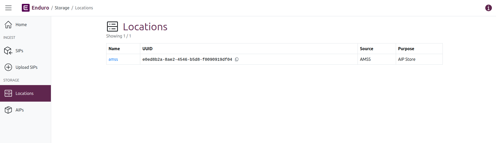
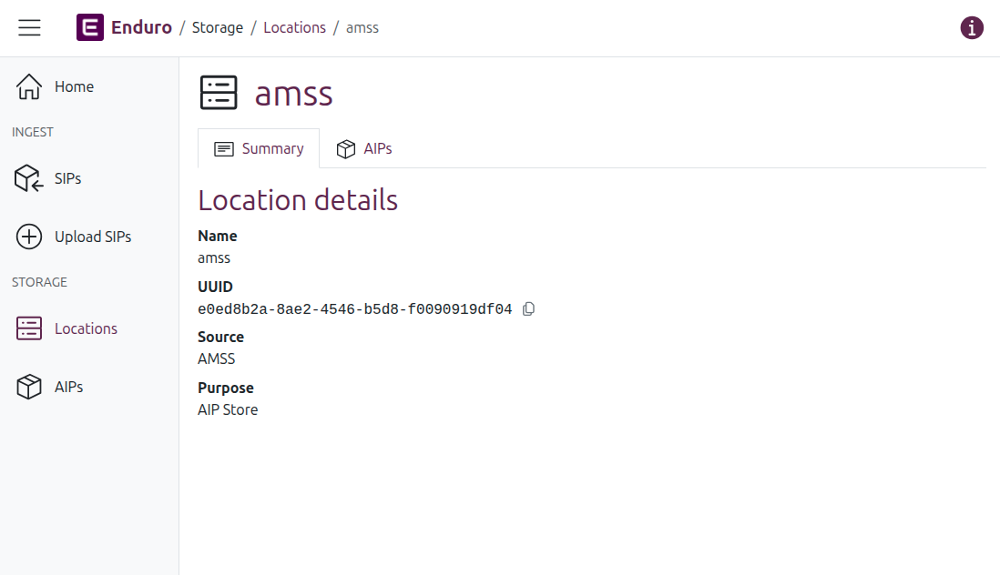

# Browse and manage locations

An overview of Locations in the Storage domain of Enduro.

-----

A **location** in Enduro is a space configured for the storage of information
packages. This can be a directory on a local server or a third-party object
store (such as those provided by MinIO, S3, and Azure). See the Administrator's
manual for more information on supported storage solutions and configuration.

You can browse configured locations, see basic details about them, and
view a list of AIPs associated with a given location.

## Browse locations

To browse your configured locations, Click the "Locations" menu item under the
Storage header in the [navbar] on the left side of the screen. Enduro will
redirect you to the Locations browse page:

The browse page will show a list of results in a table, with a count of results
listed under the page title.

Columns in the results table include:

* **Name**: The name of the associated location. This name is also a hyperlink:
  click the link to navigate to the Location's [view page](#view-a-location).
* **UUID**: The unique identifier associated with the location.
* **Source**: The location provider.
* **Purpose**: Brief description of the intended purpose of the location in the
  overall preservation plan - examples include: AIP Store, DIP Store,
  Quarantine, etc.

## View a location

To navigate to the **view page** of a configured location, click on the
hyperlinked location name in the Locations browse page results. Enduro will
reload the page and display more details about the selected location:

There are two tabs on a Location view page: the location Summary tab, and a tab
listing related AIPs. By default the Summary tab is shown; click on the tabs to
swap views.

### Location summary tab

The **Summary tab** currently lists the same information found in the
[Browse locations](#browse-locations) results table:

* **Name**: The name of the associated location. This name is also a hyperlink:
  click the link to navigate to the Location's [view page](#view-a-location).
* **UUID**: The unique identifier associated with the location.
* **Source**: The location provider.
* **Purpose**: Brief description of the intended purpose of the location in the
  overall preservation plan - examples include: AIP Store, DIP Store,
  Quarantine, etc.

!!! tip

    You can quickly copy the UUID of a location by clicking the icon to the
    right of it

     

### Location AIPs tab

The **AIPs** tab displays a list of all AIPs currently associated with a given
location.

A count of the total number of associated AIPs is shown above the results table.

The AIPs results table includes summary information about the associated AIPs.
Columns include:

* **Name**: The name of the AIP. Whenever only 1 AIP is derived from an ingested
  SIP, the AIP name will be identical to the original SIP name, making searching
  across domains easier.
* **UUID**: The unique identifier assigned to the AIP during the preservation
  process.
* **Deposited**: A timestamp of when the AIP was received and stored in the
  current location.

!!! tip

    Internally, Enduro will store timestamps in Coordinated Universal Time, i.e.
    [UTC](https://en.wikipedia.org/wiki/Coordinated_Universal_Time). However,
    the user interface will then render those timestamps based on your browser's
    or operating system's configured timezone settings.

[navbar]: ../overview.md#navigation
