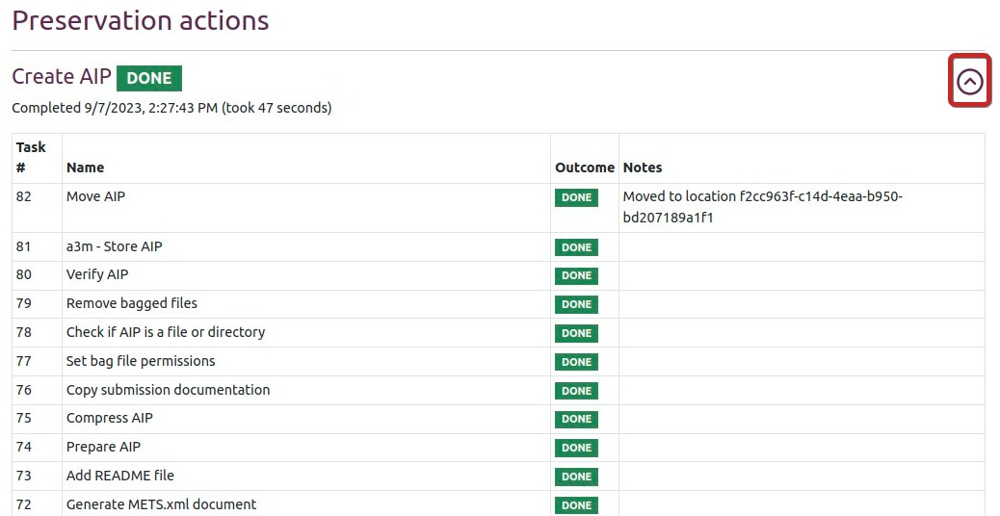
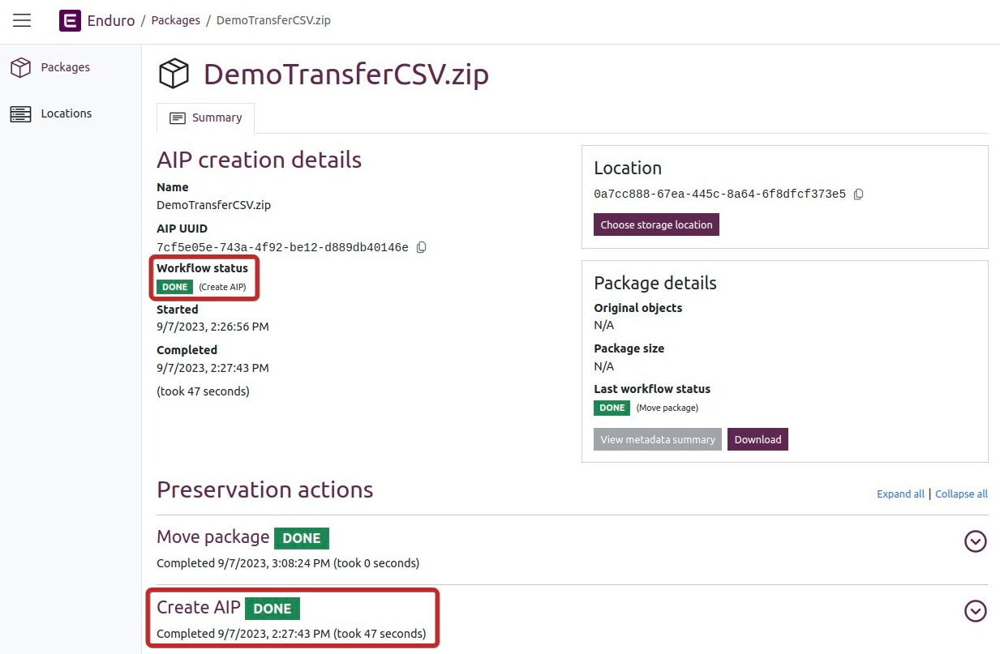
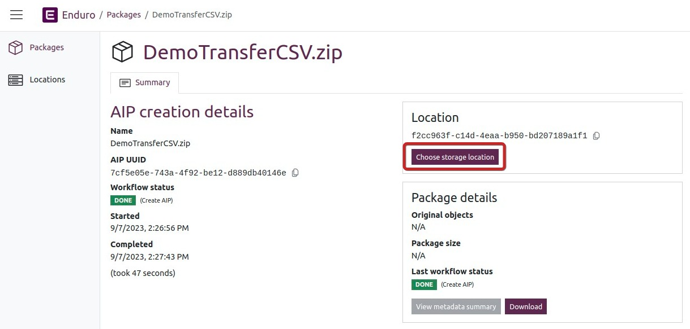
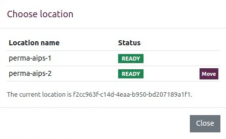
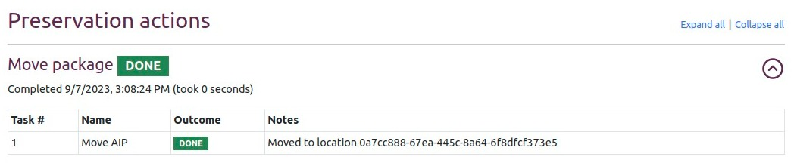

# User manual

This is a user manual for SDPS Enduro, a version of the Enduro project that
uses a3m to preserve digital objects.

## What is SDPS Enduro?

Enduro is a tool that was developed to automate the processing of transfers in 
multiple Archivematica pipelines.

This version of Enduro uses [a3m](https://github.com/artefactual-labs/a3m)
instead of Archivematica to preserve digital objects, alongside
[MinIO](https://min.io/) for object storage and [Temporal](https://temporal.io/)
to manage the workflow. This combination of tools is intended to be lightweight,
scalable, and easy to install.

### Components

#### MinIO

[MinIO](https://min.io/) is a flexible, high performance object storage
platform. Enduro uses MinIO as its storage back-end for both uploading
submission information packages (SIPs) and storing archival information packages
(AIPs). Material intended for preservation can be uploaded to MinIO either
through the user interface or via command line using the [MinIO
client](https://min.io/docs/minio/linux/reference/minio-mc.html). Any time new
content is uploaded to a designated bucket in MinIO, a transfer is started in
Enduro.

#### Temporal

[Temporal](https://temporal.io/) is responsible for orchestrating Enduro's
workflows - that is, for kicking off tasks, managing them, and recording them as
auditable events. It also manages retries and timeouts, resulting in a reliable
platform that can process digital objects for preservation in a highly automated
environment.

#### a3m

[a3m](https://github.com/artefactual-labs/a3m) is a streamlined version of
[Archivematica](https://archivematica.org) that is wholly focused on AIP
creation. It does not have external dependencies, integration with access
systems, search capabilities, or a graphical interface. It was designed to
reduce the bulk of Archivematica's extraneous functions for users operating at a
large scale who are more focused on throughput of digital objects for
preservation.

## Creating an AIP

This documentation is a work in progress. Since a3m is a derivative of
Archivematica, you can refer to the [Archivematica
documentation](https://archivematica.org/docs/latest/) for much more detailed
explanations of specific facets of the system.

### Configuring preservation actions

Similar to Archivematica, a3m consists of a series of processing tasks (called
preservation actions) that can be configured to suit a variety of preservation
needs. However, it is not currently possible to set these configurations in the
user interface. Instead, preservation actions can be configured by editing a
config file.

### Prepare digital objects

Digital objects and their metadata can be packaged in a few different ways for
upload to the system. a3m is format-agnostic, meaning that it can accept any
file that you pass to the system for processing. A single transfer can be
homogenous or it can be a mix of many different formats. In all cases, the
digital objects must be packaged together as either a `.zip`, `.tgz`, or
`.tar.gz`.

a3m reuses two of the transfer types from Archivematica - zipped directory and
zipped bag. a3m will automatically recognize the transfer type and adjust its
processing workflow accordingly.

* **Zipped directory**: digital objects that have been packaged together using
  the `.zip`, `.tgz`, or `.tar.gz` packaging format. When a zipped directory 
  transfer starts, the zip will be unpacked. The internal structure of a zipped 
  directory transfer can either be a loose collection of files, or it can
  include structures like a metadata directory.

* **Zipped bags**: digital objects that have been packaged according to the
  [BagIt File Packaging Format](https://tools.ietf.org/html/rfc8493),
  colloquially known as bags. Bags must be packaged together using the `.zip`,
  `.tgz`, or `.tar.gz` packaging format. Archivematica will verify the bag early
  on in the transfer process, looking at manifest information created during the
  bagging process such as checksums and the payload oxum.

For more information on how a3m/Archivematica implement the BagIt specification,
please see [Unzipped and zipped
bags](https://www.archivematica.org/docs/latest/user-manual/transfer/bags/#bags)
in the Archivematica documentation.

### Upload to MinIO

1. In MinIO, navigate to the Object Browser and select your upload bucket. In
   this example, the upload bucket is called `sips`.

   

2. Click on **Upload** and then select **Upload file**. This will open a file
   browser.

   

3. In the file browser, locate your transfer package and upload it to MinIO.
   Once the progress bar has completed, Enduro will begin processing the
   transfer. 

### View tasks in Enduro

1. In Enduro, navigate to the Packages tab. The list of packages will show the
   most recent package first. You will also see the UUID of the package, when
   processing started, and the UUID of the location where the package is stored.
   The Status column will display one of five possible statuses:

   * **Done**: The current workflow or task has completed without errors.
   * **Error**: The current workflow has encountered an error it could not
     resolve and failed.
   * **In Progress**: The current workflow is still processing.
   * **Queued**: The current workflow is waiting for an available worker to begin.
   * **Pending**: The current workflow is awaiting a user decision.

   

1. For more information about the package, click on the name of the package to
   access the package detail page.

   

2. At the bottom of the package detail page, there is a list of **Preservation
   actions** undertaken on each package. Clicking on the arrow will open a list
   showing all the tasks that comprise the preservation action.

   

### Preservation actions

a3m performs the following actions, amongst others, to transform your digital
material into an AIP:

* **Remove hidden files and directories / Remove unneeded files**: removes
  hidden files as well as unneeded files. This includes system files like
  `Thumbs.db`, `Icon`, `Icon\r`, and `.DS_Store`.
* **Verify transfer compliance**: verifies that the transfer is properly
  structured according to the requirements of the transfer type.
* **Assign UUIDs**: assigns a unique universal identifier to each digital
  object and metadata file.
* **Assign checksums and file sizes**: computes the checksum and file size of
  each digital object and metadata file.
* **Change object and directory filenames**: removes prohibited characters from
  folder and filenames, such as ampersands.
* **Identify file format**: Identifies the format of all digital objects and
  metadata files. See 
  [Identification](https://www.archivematica.org/en/docs/archivematica-latest/user-manual/preservation/preservation-planning/#identification)
  in the Archivematica documentation for more information.
* **Characterize and extract metadata**: extracts technical metadata embedded in
  the digital objects. See
  [Characterization](https://www.archivematica.org/en/docs/archivematica-latest/user-manual/preservation/preservation-planning/#characterization)
  in the Archivematica documentation for more information.
* **Validate formats**: validates file formats against the format’s
  specification. See
  [Validation](https://www.archivematica.org/en/docs/archivematica-latest/user-manual/preservation/preservation-planning/#validation)
  in the Archivematica documentation for more information.
* **Examine contents**: runs [Bulk
  Extractor](https://github.com/simsong/bulk_extractor/wiki)
* **Normalize**: converts a digital object to a preferred preservation and/or
  access format. See
  [Normalization](https://www.archivematica.org/en/docs/archivematica-latest/user-manual/ingest/ingest/#normalize)
  in the Archivematica documentation for more information.
* **Transcribe**: transcribes the relevant text from digital objects using
  [Tesseract](https://github.com/tesseract-ocr/). See
  [Transcribe SIP contents](https://www.archivematica.org/en/docs/archivematica-1.14/user-manual/ingest/ingest/#transcribe-contents)
  in the Archivematica documentation for more information.
* **Generate METS.xml document**: creates the AIP's METS file. For more
  information about the purpose and contents of the METS file, see [AIP METS
  file](https://www.archivematica.org/en/docs/archivematica-1.14/user-manual/archival-storage/aip-structure/#aip-mets)
  in the Archivematica documentation.
* **Prepare AIP**: rearranges the content to be consistent with the AIP
  specification and bags the content according to the BagIt File Packaging
  Format. See [AIP
  contents](https://www.archivematica.org/en/docs/archivematica-1.14/user-manual/archival-storage/aip-structure/#aip-contents)
  in the Archivematica documentation for more information.
* **Store AIP**: stores the AIP in the configured storage location.

### Troubleshooting

If there is an error in any preservation action, the outcome will be listed as
"Error" or (another status? TBC). Currently, the easiest way to analyze an error
as a front-end user is to look at the list of jobs in Temporal, Enduro's
workflow engine, and read the job output.

## Download AIP

1. If your AIP has been successfully processed, the workflow status for the
   Create AIP Preservation Action should be set to Done. This is shown in two
   different places on the page - in the **AIP creation details** section of the
   main body of the page as well as under **Preservation actions** at the
   bottom.

   

2. You can download the AIP by clicking on **Download** in the **Package
   details** section.

## Move AIP

You can move packages to other storage locations that have been connected to the
Enduro instance. In this example, all of the storage locations are configured
through MinIO.

1. On the package detail page in Enduro, select **Choose storage location**.

   

2. All storage locations will be displayed in the pop-up window. Storage
   locations that are available will have a **Move** button to the right of the
   location name. If there is no Move button, the package is either already
   stored in that location or the location is available for some other reason.
   Select **Move** to move the package to your preferred location.

   

3. An admonition will appear indicating that the package is being moved. You may
   need to refresh the page to see that the package has been successfully moved.

4. A new Preservation Action called **Move package** will appear at the bottom
   of the page. You can click on the arrow to see more information about the
   move.

   
